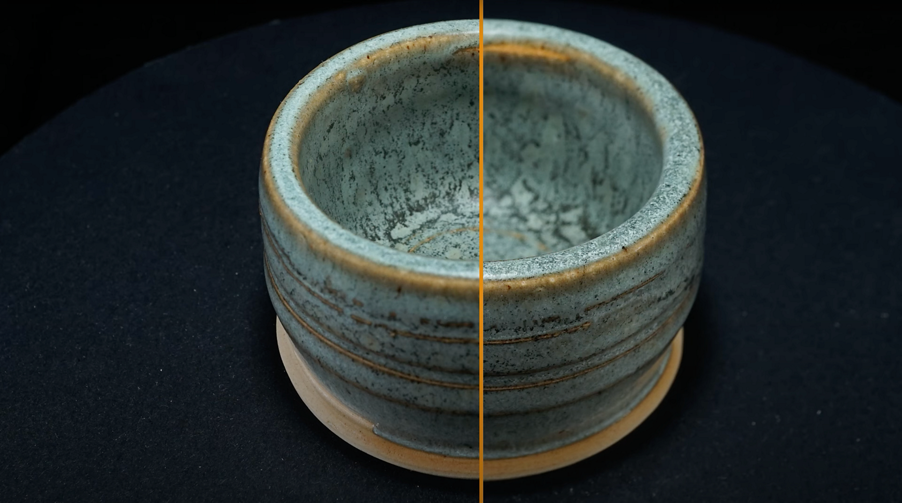

# 相机设置焦点

>[!WARNING]
>
> 自Sampler版本5.1起，已移除对3D 捕捉的支持。

## 相机设置 — 焦点

<b>光圈</b>是最复杂的相机设置，因此我们将在本深度中对其进行说明。

您希望以视频教程的形式观看本指南？ 您可以在[此处](https://youtu.be/kFZ71ZWuap0?si=MDuvyO9w96rFpsQ9 "3D 捕捉视频教程的光圈和焦点")找到它。

## 聚焦镜头

默认情况下，相机的自动对焦系统可控制此设置，自动设置焦点。 这在拍摄人物、大型环境或任何动态内容时都有意义，但对于我们受控、静止的主体而言，它甚至可能会导致问题；自动对焦可能会出错并毁掉照片，即使在两张照片之间也是如此。

每个DSLR都可以从自动对焦切换到完整的<b>手动对焦</b>。 这意味着通过扭曲镜头上的聚焦环，您可以完全控制焦距。 这样你就可以确保焦点不会从镜头之间跳过。 如果您阅读了相机手册，则可能会有一些有助于您的设置，例如“焦点峰值”，即在该相机显示上绘制彩色效果。 这有助于查看聚焦的图像部分。 甚至可能还有缩放放大镜，显示屏显示当前视图的一个小的放大部分，帮助您实现完美像素聚焦。 特别是这个缩放放大镜对帮助您确定焦距至关重要。

使用手动对焦将帮助您更好地查看和了解您的<b>光圈</b>和<b>焦点</b>正在发生的事情。 缺点是，每次移动相机或主体时，都必须<b>重新调整焦点</b>。 我们很容易忘记并毁掉照片，所以最好养成这种习惯。

## 选择光圈值

<b>光圈</b>比较棘手，因为它会影响<b>焦点</b>和<b>锐度</b>。 我们不希望拍摄主体的某些部分不聚焦，这给摄影测量过程带来了问题。 这意味着大光圈（对于标准镜头，通常介于f1.8和f3.5之间）将是一个问题。 另一方面，对于尽可能小的光圈，f/32也不是很好，这一端的光线也变得不那么锐利，而入射的光量很小，导致照明不足的问题。

光圈越小，场深度越宽，但场宽也随焦距而缩放； 这意味着近距离将获得更多的场深度，更远、更少的区域将获得完全的锐化。 如果您希望小对象占据照片的大部分区域，则对于小对象可能会出现问题。

那么，正确的光圈价值是什么？ 经验法则是，找出镜头的最清晰光圈范围，并从此值开始。 这可能是<b> F8或f11，最高为f16</b>。  检查<b>所有内容是否都聚焦</b>，如果没有，请逐步减少到f20左右。 如果对象仍未完全聚焦，请尝试将其移开一点。 即使是距离10-15 cm的物体，其差别也很大。

此外，请记住，镜头的选择也会产生不同凡响的效果。 附带相机的默认套件镜头通常不是最清晰或最高品质的，因此值得投资购买更高品质的镜头。 特写镜头可以使用微距镜头，因为它可以让您的焦点更加靠近镜头。

## 焦点括号

有一种特别的技巧可以做到，就是在所有其它方法都失败时实现完美的锐化。 <b>对焦括号</b>表示您以<b>不同的焦距</b>拍摄<b>多张照片</b>，并在Photoshop中将其合并。 它需要<b>大量额外工作</b>，特别是对于全循环系列，因此，它只应作为最后的手段使用。

如果您有2张或更多不同焦点的照片，请将其载入不同的图层。

选择所有图层，然后转到<b>编辑</b> > <b>自动对齐图层</b>。 使用默认设置单击确定。 Photoshop将尝试对所有选定图层执行像素级完全对齐

接下来，转到<b>编辑</b> > <b>自动混合图层</b>。 再次使用所有默认设置选择确定。 Photoshop会将图层中最锐利的部分混合在一起。

如果一切顺利，现在您会获得一张非常清晰的照片。 为了节省您的时间，建议您将这些步骤中的至少一些转变为录制操作。

现在，您已经了解了3D 捕捉过程中光圈和焦点的所有须知信息，请进一步了解如何[创建理想的光照设置](3d-capture-lighting-substance-3d-sampler.md)。
