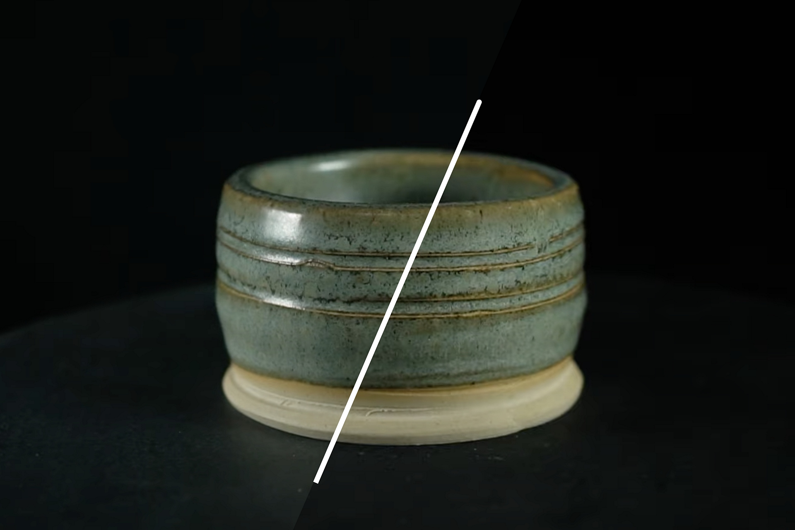

# 用于3D 捕捉的交叉偏振

>[!WARNING]
>
> 自Sampler版本5.1起，已移除对3D 捕捉的支持。

## 交叉偏光

在本用户指南中，我们将介绍如何处理反射对象及其导致的问题，以及如何使用光偏振来解决此问题。

您更喜欢通过视频教程了解此主题？ 在[此处](https://youtu.be/VWsbP56MDk0?si=Hdp7vblJB6L1RPxK "交叉偏振教程")找到它。

当光线射入表面时，它通常以漫射的方式反射，均匀地反弹，从而赋予表面颜色外观。 但根据表面粗糙度，一些光线可以直接反射到您的眼睛或相机上。 此<b>Specular反射</b>会根据您的视角而变化。

摄影测量学是通过在照片之间对齐视觉图案和元素来工作，它假定对象的外观不会在每张连续照片之间发生更改。 所以，Specular反射是一种不受欢迎的效果。 一个温和的物体可能只有一个反射涂层，但金属物体可能会复杂得多，需要付出更多努力才能解决。 我们将处理本用户指南中的轻症案例。 我们只需捕捉到一种不受高光Specular破坏的完美基色。 捕捉后，很容易以3D形式重新添加反射率。

为了解决这个问题，我们可以使用<b>交叉极化</b>的方法来滤除Specular反射。 当光偏振时，所有的波都指向相同的方向。 如果再朝垂直方向极化一次，它就会完全被阻挡，从而使其不可见。

偏振主要影响Specular光，因为这些是聚焦光线，在特定的方向行进，与我们想要保留的散射漫射光相反。

使用偏振滤光片将光偏振化，这是一种特殊的透明片，用于过滤光波。 它们有多种形式，我们将对您的镜头使用旋盖玻璃滤镜，以及DIY风格的偏光胶片

基本想法是<b>向您的光线添加滤镜</b>和<b>您的镜头</b>，并将它们设置为<b>相互垂直</b>。 这意味着您需要通过旋转滤镜来微调滤镜方向。 一旦Specular被设置好，来自光线的反射就会变得不可见。 特别的是，扭曲滤镜可以突然完全消除偏振光中的所有眩光。

您应该为镜头购买偏振光滤镜，因为您需要的是最佳光学，同时还要能够拍摄清晰的清晰照片。 不同的镜头有不同大小的螺纹来旋入滤镜，因此请确保为所选的镜头获取合适的螺纹，或者为多个镜头获取几个大小的螺纹（如果您正在尝试）。

偏光更便宜也更简单：<b>偏光胶片</b>相对便宜。 可使用整个页面或切出各部分。 最好裁剪覆盖整个光线的圆形部分，因为这样更容易旋转它们。 有些灯光更适合用于此目的，它们可能有一个小滤镜固定器，或磁铁将纸片固定到位。 如果不是，粘胶带始终有效！

确保<b>在任何漫射器之后添加偏振器</b>，因为漫射将消除任何偏振。

价格便宜的环形闪光灯可旋入滤镜插槽，而且可能不再允许您连接镜头滤镜。 他们也没有办法在闪光灯本身上添加偏振滤镜，所以你必须自己做。 只有最顶级的型号才能正确支持此功能。

<b>需要不断在你的设置中完成旋转和匹配的偏光器</b>。 镜头滤镜需要完全垂直于所有光线，唯一方法是查看相机显示屏并调整光线。 首先，我喜欢将一张纸贴在闪光灯上，然后调整镜头滤镜来遮挡闪光灯的反射。 这只能通过拍照或干烧闪光灯来实现。 这里有一点介绍，您可以使用标记在镜头滤镜上标记正确的方向，然后尝试不再触碰镜头和闪光滤镜。

调整视频光线上的偏振状态是不同的，但更容易。 在移动光源或调整相机Height时，您需要不断调整光源。 只需<b>旋转页面，直到它显示在相机显示器上</b>。

<b>每个在反射中出现的光源都需要进行极化</b>，因此可能必须关闭窗口或关闭屏幕。

正确设置后，您应该能够捕捉对象，就好像它是完全遮罩一样，没有任何反射，甚至没有光照。 与仅应用基色纹理时看到网格一样，它允许您捕捉难以反射的对象。

现在详细了解[如何使用Substance 3D Sampler处理您的3D 捕捉](processing-advanced-3d-captures.md)！
