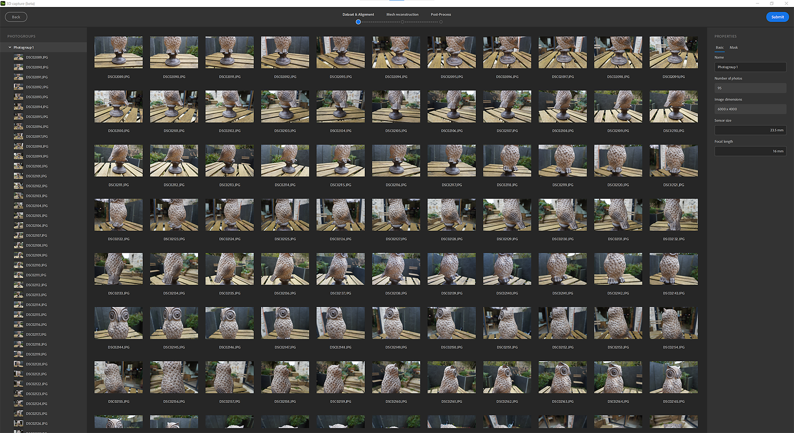
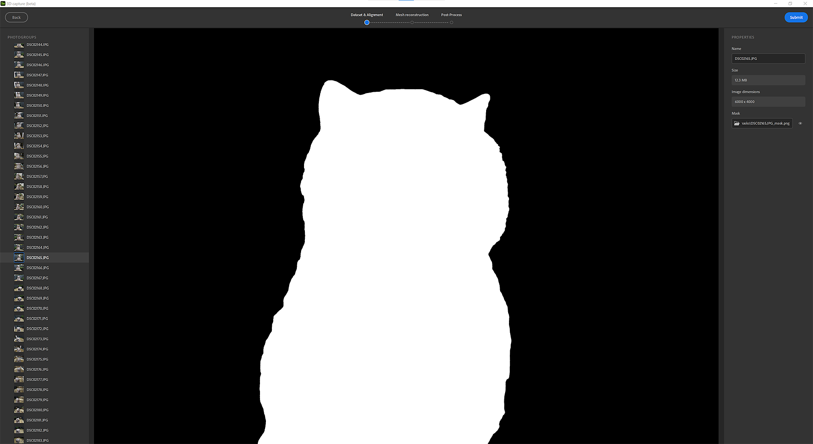
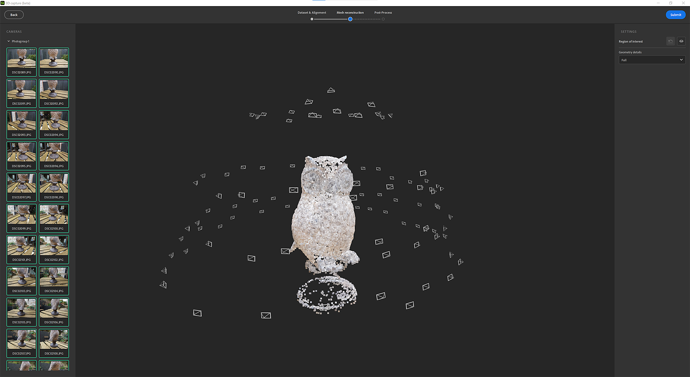
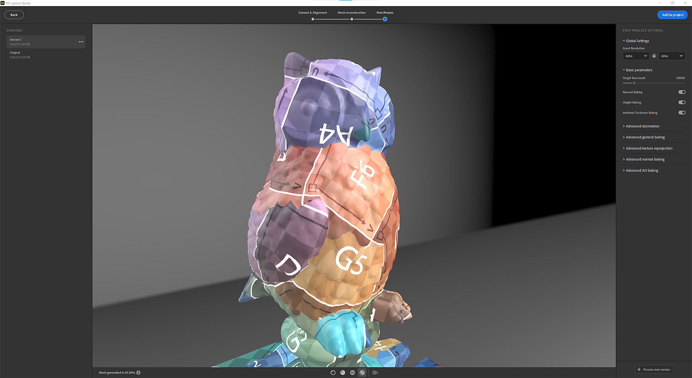

# 3D 捕捉

## 快速入门

## 什么是摄影测量？

Sampler使用摄影测量将图像转换为具有纹理的网格。 摄影测量学是一门从图像中进行测量的科学。 它用于从照片中提取信息，创建3D模型和纹理。 该过程包括从不同角度拍摄物体的多张照片，然后处理图像以提取图像中特征的形状和位置的信息。

其目的是为了匹配图像之间的对应特征，为每一幅图像建立相机的相对位置。 根据匹配特征重构出物体的三维模型。 最后一步是将纹理投影到3D模型上。

## 硬件要求

该3D 捕捉可在Windows和MacOS Monterey或Ventura上使用。

Windows/Linux

我们建议：

* GPU具有8 Gb显存
* 16 Gb内存。 理想情况下，为32 Gb和64 Gb。
* 最少10Gb磁盘空间

[Linux配置](https://helpx.adobe.com/cn/substance-3d/unlisted/documentation/sadoc/3d-capture-set-up-on-linux-255426606.html)

Mac

* 强烈推荐Apple芯片设备（M1或M2）
* 基于Intel的GPU和AMD GPU，至少支持4 Gb VRAM和光线追踪

## 开始新3D 捕捉

## 导入您的数据集

## 数据集准备

拖放您的照片或单击以浏览您的操作系统资源管理器。

>[!NOTE]
>
> **数据集建议**
> 
> 我们建议使用包含至少<b>20个图像</b>的数据集，以便3D 捕捉平稳运行。

对于iPhone用户，尚不支持.HEIC格式。 您可以使用Lightroom转换为.jpeg。

在MacOS上，您可以使用[快速操作](https://support.apple.com/en-gb/guide/mac-help/mchl97ff9142/mac)来转换图像。

对于相机原始数据格式，我们建议使用Lightroom将照片转换为.jpeg格式。

>[!NOTE]
>
> **数据集限制**
> 
> **Windows**：数据集的总像素必须小于6G （6 000 000 000像素）。 它代表500张照片，1200万像素

导入照片后，单击照片即可查看完整照片。

照片组定义：

您的数据集可以拆分为多个照片组。 照片按属性（传感器大小、焦距、旋转……）分组照片

## 蒙版

使用蒙版具有许多优点。 它允许摄影测量过程检测特征，并且仅重构未遮罩的区域。

这还允许在拍摄期间移动对象，因为蒙版将隐藏所有照片中的背景。

要使用蒙版，请选择一个照片组并打开右侧的&#x200B;**蒙版**&#x200B;选项卡。

您可以通过遵循命名惯例来导入蒙版：

* [image\_name].file\_extension
* [image\_name]\_mask.file\_extension

您可以使用我们的AI技术支持的技术通过照片自动生成蒙版。

## 对齐方式

配准是对所有图像进行处理，提取并匹配相应的特征，为每一幅图像建立相机的相对位置。

## 设置

精度

有两个选项：低和高。

* 低：建议用于大多数数据集。
* 高：增加点数，建议在主体纹理不足或照片较小的情况下匹配更多照片。 此设置使处理速度变慢。 我们建议您先尝试低级别选项。

照片排序

有两个选项：默认和序列。

这可以使用不同的特征匹配算法计算：

* 默认值：选择基于多个标准，其中包括图像之间的相似度。
* 序列：仅使用给定距离内的相邻图像，建议在默认模式失败时处理单个照片序列。 照片插入顺序必须与序列顺序相对应。

## 点云和相机位置

经过配准后的点云为稀疏点云且包含所有特征点，且包含所有摄像机的位置。

如果图像轮廓为绿色，则表示图像已正确对齐。

如果图像轮廓为橙色，则表示图像未正确对齐，并且未从此图像中提取任何特征。

可以单击左侧面板上的图像来框住相关相机上的点云。

您可以单击相机以在其上框住点云。

## 重建

当将纹理投影到3D模型上时，重构步骤从匹配特征产生对象的3D模型。

## 设置

几何细节此选项指定输入照片的精度级别，这将在计算的3D模型中产生更多或更少的细节。

## 目标区域

在生成3D模型之前，您可以使用定界框设置要围绕点云重构的区域。

可在3轴中平移、缩放和旋转框。

在缩放时按Shift键，将从中心缩放该框。

<table>
<tr style="border: 0;">
<td style="border: 0;" valign="top">

</td>
<td style="border: 0;" valign="top">

</td>
</tr>
</table>

## 后期处理

后期处理可帮助您根据需要和使用方式调整和优化网格和纹理。

重建的结果可以生成具有数百万个多边形和高达16K纹理的网格。 这通常不会针对渲染、实时体验或AR体验进行优化。

您需要对结果进行后期处理，以减少多边形的数量并且不会丢失细节。

后处理步骤会自动链接4个步骤：

* 抽取：通过定义所需的表面数量来减少多边形的数量
* UV展开：自动定义网格的接缝、展开和打包UV
* 重新投影：将摄影测量网格的颜色纹理重新投影到网格上
* 烘焙：将摄影测量网格中的法线、Height和AO细节烘焙到精选网格上。 这将确保将在抽取过程中丢失的所有网格细节转移到纹理映射中。

## Version

要轻松迭代和测试不同的后期处理选项，可创建多个版本并选择一个版本以添加到您的项目。

为帮助您，可在不同模式下可视化网格。

纯色模式

线框模式

UV网格模式

## 无损工作流

将某个版本添加到项目后，将创建一个包含多个图层的图层栈栈。

第一层为重建结果。

第二个图层（如果进行了某些后处理）是具有3D 捕捉窗口中定义的值的网格后处理图层。 如果要使用其他设置，仍可以在此步骤编辑参数。

第三个图层是网格变换图层，用于缩放、平移和旋转3D对象。

在此阶段，您可以添加用于在材质上应用的滤镜，以编辑3D对象上的纹理。

## 导出

在导出窗口中，可以定义网格格式和材料设置（导出材料时的相同设置）。

## 教程

[转到高级Tutorials](https://substance3d.adobe.com/tutorials/courses/Advanced-3D-Capture/youtube-f8iCtZ3Gmzs)

## 常见问题解答

**摄影测量的最佳拍摄条件是什么？**

为了使用摄影测量技术生成准确的结果，在拍摄图像时务必遵循某些最佳实践。

1. 光照：在良好的光照条件下拍摄图像时，摄影测量效果最佳。 避免在低光或高对比度光照下拍摄图像，因为这样可能难以从图像中准确提取特征。 摄影测量的最佳光照条件为阴天或阴影区域。
1. 重叠：为了确保图像中有足够的信息来准确提取特征，捕获具有显着重叠的图像非常重要。 一般经验法则是，图像之间至少要有60%的水平和垂直重叠。
1. 相机：使用高分辨率的相机和镜头，以便获得良好的图像质量和清晰度。 避免使用带有鱼眼镜头或广角镜头的相机，因为这可能引起几何扭曲，从而影响最终结果。
1. 方向：拍摄图像时，尝试保持相机水平并与地面垂直。 以一定角度拍摄的图像很难准确提取特征，并且可能会导致结果失真。
1. 相机校准：确保在拍摄图像之前校准相机。 此过程允许校正镜头扭曲和其他可能影响最终结果精度的错误。

**它如何处理Specular和反射对象？**

摄影测量在处理高Specular或高反射对象时可能很困难，因为明亮反射会使从图像中提取特征变得困难。 以下几种策略可以用来克服这些挑战：

1. 光照：在拍摄高反光物体的图像时，尽量避免阳光直射，而应在阴天或阴影条件下拍摄图像。 这有助于降低反射强度，并便于从图像中提取特征。
1. 遮罩光洁度：对反射表面应用遮罩光洁度有助于降低反射强度，并更容易从图像中提取特征。
1. 捕捉多个图像：从不同角度捕捉同一对象的多个图像有助于减少反射的影响，并增加从至少一些图像中提取特征的几率。
1. 图像编辑：在后期处理中，某些图像编辑软件（如Lightroom）可用于减少图像中的反射并增强图像中的特征，如增加对比度或颜色校正。

请记住，反光物体可能需要更细致的设置和处理，而且不可能在所有情况下都获得完美的结果。 最好尝试不同的技巧。

**手机和单反相机之间关于摄影测量的推荐是什么？**

移动电话和单反相机均可用于摄影测量，但它们各有优缺点。 在决定使用哪种类型的相机时，需要考虑以下几点：

1. 分辨率：单反相机通常比移动电话的分辨率高得多，这样可得出更详细、更准确的结果。 然而，随着近期手机相机的发展，一些高端手机相机的分辨率和图像品质可与一些低端单反相机相媲美。
1. 相机校准：摄影测量依赖于准确的相机校准，使用手机相机比使用单反相机通常更难以实现。 一些手机相机具有可以使用的内置校准参数，但它可能不如单反相机的正确校准准确。
1. 电池续航时间和存储空间：与单反相机相比，手机相机的电池续航时间更有限。 因此，您必须计划在工作时给手机充电或携带额外的电池。 此外，您需要确保手机有足够的存储容量来处理大型图像文件。
1. 成本：单反相机通常比手机贵，还需要额外的配件，如三脚架和外置闪光灯装置。
1. 便携性：手机比单反相机更便携，并且当您遇到想要拍摄的有趣物体或场景以进行摄影测量时，更有可能将手机随身携带。

总之，这实际上取决于您的具体需求和项目的特点。 对于分辨率较低的项目，使用手机可能就足够了。 但是，如果需要高精度、高分辨率，单反相机可能是一个更好的选择。 此外，如果您计划定期拍照或为长期项目拍照，那么从长远来看，投资单反相机可能是一个更具成本效益的解决方案。

**如何校准相机以限制对象上的模糊？**

相机标定是摄影测量中的重要步骤，它有助于校正镜头扭曲和其他可能影响最终结果精度的误差。 下面是您可以采取的一些步骤来校准相机并限制对象上的模糊：

1. 使用三脚架：要保持相机稳定并减少模糊，在拍摄用于摄影测量的图像时，使用三脚架非常重要。 这将确保相机在拍摄每个照片时处于相同的位置，并有助于最大限度地减少相机移动。
1. 使用快门遥控器：要进一步减少相机移动，您可以使用相机上的快门遥控器或自拍器功能拍摄图像。 这有助于最大限度地减少按下快门按钮所导致的任何相机抖动。
1. 调整快门速度：要减少相机移动导致的模糊，您应该使用较快的快门速度。 经验法则是，使用至少与镜头焦距倒数相同的快门速度。 例如，如果您使用的是50毫米镜头，则应使用至少1/50秒的快门速度。
1. 使用高ISO：在低光照条件下，您可能需要使用较高的ISO来保持较快的快门速度并减少模糊。 但是，请记住，高ISO也会增加图像中的杂色，这可能会影响最终结果的精度。
1. 使用闪光灯：在某些情况下，使用闪光灯有助于减少由低光导致的模糊。 请记住，在某些情况下，闪光灯还会导致反射和其他问题，因此请务必尝试使用闪光灯和非闪光灯拍摄，以查看哪种方式最适合您的特定应用程序。

请记住，校准是一个迭代过程，可能需要多次尝试才能获得好的结果。

**我可以在拍摄摄影测量期间移动对象吗？**

大多数情况下，建议不要在拍摄期间移动对象以进行摄影测量。 摄影测量过程依赖于物体在每一幅图像中处于固定位置，因为软件利用图像中特征的相对位置来重构物体的三维模型。

如果在捕捉过程中移动了对象，对象将在每个图像中出现在不同的位置，使得软件很难匹配图像之间的相应特征。 这样不仅会导致最终三维模型不精确，还会使图像匹配步骤变得困难或不可能。

但是，在某些情况下，移动对象可能非常有用。 例如，对于小对象，很难拍摄具有显着重叠的图像，此时可以使用转台并旋转对象以确保从多个角度捕捉所有特征。
