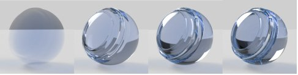
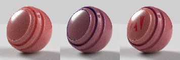
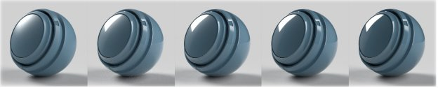

# Adobe 标准材质

>[!NOTE]
>
> Substance 3D Sampler现在默认为[OpenPBR](openpbr.md)材质模型，而不是Adobe标准素材。

## 标准素材属性

## 基础曲面属性

**基色**

表面的颜色。

**粗糙度**

表面的平滑或哑光程度。

**金属质感**

表面的金属光泽度。

**不透明度**

曲面的可见性。

**环境遮蔽**

凹腔中的阴影和折痕，防止光线到达表面。

**Specular level**

曲面上光线反射的强度。

**Specular edge color**

光反射的颜色。 影响金属材料的倾斜角度。

**正常**

模拟表面细节，如凸起和裂缝。

**正常缩放**

正常效果的强度。

**将普通字体和Height字体合并**

在Height纹理顶部应用常规纹理。

**Height**

使用凹凸或几何位移创建曲面细节。

**Height缩放**

场景单位中的Height比例。 适用于凹凸和位移。

**Height级别**

表示零位移的Height纹理的值。

**各向异性级别**

反射沿曲面一个方向拉伸的数量。

**各向异性角度**

各向异性效应的逆时针旋转。

**发射强度**

从表面发射的光的强度。

**发射颜色**

发射光的颜色。

**光泽不透明度**

模拟微观纤维或纤维在表面的作用。

**光泽颜色**

光泽效果的颜色。

**光泽粗糙度**

柔和的光泽效果。

## 内部属性

**半透明**

能透过表面的光量。

**吸收色**

彩色光在被吸收时将汇聚。

**吸收距离**

光线在到达吸收色之前将传播的近似距离，以场景单位表示。 如果设置为零，则Thickness不会影响吸收色。

**折射率**

光线穿过对象时会发生弯曲。

**离散**

折射时颜色色谱扩展的数量。

**次表面散射**

将光从表面散点，而不是直接穿过表面。

**散布颜色**

散射光将变为表面下方的颜色。

**散射距离**

在达到完全散射之前，光线必须行进大致距离。

**散射距离刻度**

散点距离的倍数。 每个颜色通道可能不同。

**红移**

设置红光，使其比其他浅色移动得更远。 对皮肤有用。

**瑞利散射**

设置橙色光以在表面下方进一步传输，设置蓝色光以在表面下方进一步传输。

**卷Thickness**

曲面相对于对象边框的Thickness。 用于真实Thickness未知时的内部效果。

**卷Thickness缩放**

音量Thickness的乘数。

## 涂层属性

**皮毛不透明度**

模拟材质顶部的图层。 用于创建清晰的涂层、漆和清漆。

**皮毛颜色**

外套的颜色。

**皮毛粗糙度**

皮毛表面光滑或哑光程度。

**涂层折射率**

当光线穿过外套时，光线会弯曲。

**涂层Specular level**

在扫视角度下皮毛上光线反射的强度。

**皮毛正常**

模拟涂层表面的表面细节，如凸点和裂缝。

**皮毛正常缩放**

皮毛强度正常效果。
