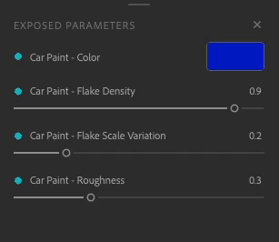

# 导出参数资源

可以在其他应用程序中修改公开参数，而无需返回到Sampler。 这样可以减少迭代时间，从而您可以专注于寻找最佳外观，而无需在应用程序之间来回切换。

## 公开和取消公开参数

要公开参数，请打开&#x200B;**属性面板**。 将鼠标悬停或右键单击所需的参数，然后单击图钉图标或“显示这个参数”。

有两种方法可取消公开参数：

* 在&#x200B;**公开参数面板**&#x200B;中，右键单击该参数，然后选择“取消公开”。

  
* 在&#x200B;**属性面板**&#x200B;中，单击交叉点图标或右键单击参数并选择“取消公开此参数”。

  

无法公开以下筛选器的参数：

* 图像到材质（AI驱动）
* 内容识别填充
* 正常到Height
* 放大

如果在包含公开参数的图层上方添加其中一个滤镜，则导出时不会显示这些参数。\
要避免此问题，请移除滤镜或将它放在不会影响具有公开参数的图层的位置。

如果从混合中公开参数，则当您移动栈叠底部的底层时，这些参数将会丢失。

## 编辑参数

编辑参数的标签，方法是右键单击&#x200B;**公开参数面板**&#x200B;上的参数，输入新名称，然后单击“应用”。

您可以在&#x200B;**公开参数面板**&#x200B;中使用参数，如&#x200B;**属性面板**&#x200B;中所示。

## 导出您的材质

要导出具有公开参数的素材，请执行以下操作

1. 打开<b>导出面板。</b>
1. 单击“export（导出）”。
1. 选择SBSAR或SBS。
1. 单击“导出”。

现在，您可以在支持SBSAR文件格式的任何软件中使用具有公开参数的材质。
