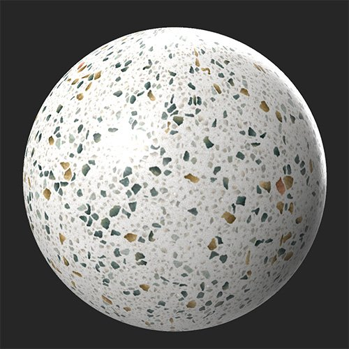

# 模糊

<table>
<tr style="border: 0;">
<td width="41.60%" style="border: 0;" valign="top">

**进入：**&#x200B;调整

</td>
<td width="58.30%" style="border: 0;" valign="top">

## 描述

模糊整个材料或选择要模糊的特定通道。

已将&#x200B;**模糊滤镜**&#x200B;下方的图像应用于base color通道。

<table>
<tr style="border: 0;">
<td style="border: 0;" valign="top">

</td>
<td style="border: 0;" valign="top">

</td>
</tr>
</table>

</td>
</tr>
</table>

## 参数

**基本参数**

* **强度**： 0-1\
  调整应用于所有通道的模糊量

**按渠道自定义**

使用这些控件单独调整每个通道的模糊量。 首先，启用通道特定模糊，此时将显示一个滑块以控制应用于该通道的模糊量。

>[!NOTE]
>
> 通道特定模糊会覆盖&#x200B;**基本参数>强度**&#x200B;模糊，用于整个材料。 因此，如果将材料模糊强度设置为1，但启用通道，并将通道模糊强度设置为0，则完全不会模糊通道，而所有其他通道都将模糊。

* ***通道*** **— 自定义模糊强度**：切换\
  启用通道特定的模糊值。
* ***通道*** ***-*** **模糊强度**： 0-1\
  调整指定通道的模糊。
