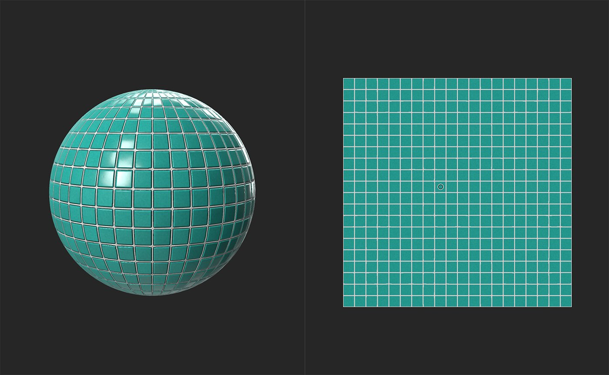

# 颜色替换

<table>
<tr style="border: 0;">
<td width="41.60%" style="border: 0;" valign="top">

**进入：**&#x200B;调整

</td>
<td width="58.30%" style="border: 0;" valign="top">

## 描述

替换通道中的选定颜色或值。

下图显示了&#x200B;**颜色替换**&#x200B;的实际操作。 请注意，拼贴之间的区域是如何保持相同的颜色的 — 只有拼贴本身会被更改。

</td>
</tr>
</table>

## 参数

**基本参数**

* **高级分段**：切换\
  启用后，滤镜可以使用单独的通道来从受“颜色替换”影响的通道生成蒙版信息。
  * **蒙版** **来自**：\
    选择一个通道以作为蒙版生成的源。 例如，来自金属值的蒙版将替换材料金属区域的base color
* **替换到**：\
  选择受颜色替换影响的通道。
* **目标颜色**：颜色选择\
  选择要替换当前通道颜色的颜色。
* **明度变化**： 0-1\
  调整原始亮度值受新颜色亮度影响的程度。
* **蒙版范围**\
  蒙版是根据以下值的组合创建的
  * **&#x200B;**&#x200B;**&#x200B;来自明度&#x200B;**： 0-1\
    用于生成蒙版的亮度范围&#x200B;**&#x200B;**
  * **源颜色**： 0-1\
    用于构建蒙版的颜色范围
* **蒙版Smoothness**： 0-1\
  调整蒙版的粒度
* **蒙版模糊**： 0-1\
  模糊蒙版

**蒙版**

此蒙版与在&#x200B;**基本参数**&#x200B;下创建的蒙版是分开的 — 您可以使用自定义蒙版来绘画，也可以使用图像来指定整个受&#x200B;**颜色替换**&#x200B;滤镜影响的区域。

* **使用自定义蒙版**：切换\
  启用或禁用自定义蒙版的使用。 如果启用，将显示以下参数：
  * **蒙版**：图像/画笔\
    选择要用作蒙版的图像，或使用画笔直接在2D 视图中绘画自定义蒙版
  * **自定义蒙版 — 模糊**： 0-1\
    模糊蒙版
  * **自定义蒙版 — 反转**：切换\
    反转蒙版

## 使用指南

**颜色替换滤镜**&#x200B;是一种用于修改材料外观的强大方法 — 例如，使用它将铁铁锈转变为氧化铜

该滤镜的工作方式是：首先基于所选点的亮度和颜色值创建蒙版，然后替换该蒙版定义的区域的颜色。 因此，要使用此滤镜，请执行以下操作：

1. 将&#x200B;**颜色替换筛选器**&#x200B;添加到图层堆叠
1. 确定要用于构建蒙版的通道，以及要替换颜色的通道
   1. 如果要将蒙版基于一个通道但替换另一个通道的颜色，请启用&#x200B;**高级分段**&#x200B;并选择相应的通道。
   1. 如果要将蒙版基于通道并替换同一通道的颜色，请将&#x200B;**高级分段**&#x200B;保持禁用状态。
1. 将&#x200B;**2D 视图**&#x200B;中的控件移至您要替换的颜色上。
1. 使用&#x200B;**蒙版范围**、**蒙版Smoothness**&#x200B;和&#x200B;**蒙版模糊**&#x200B;控件调整蒙版覆盖的区域。
1. 选择&#x200B;**目标颜色**，并调整&#x200B;**明度变化**，直到您对效果满意为止。
1. （可选）添加自定义蒙版以仅在所选区域应用滤镜效果。 自定义蒙版不会影响在步骤1中创建的蒙版，而是您可使用它作为附加蒙版进一步调整应用效果的位置。

有时，在多个&#x200B;**颜色替换滤镜**&#x200B;之间使用可能会很有用，可以创建更高级的效果。
