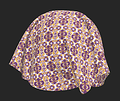

# 填充

<table>
<tr style="border: 0;">
<td width="41.60%" style="border: 0;" valign="top">

**进入：**&#x200B;调整

</td>
<td width="58.30%" style="border: 0;" valign="top">

## 描述

使用&#x200B;**填充滤镜**，可以根据选定的值替换或调整特定通道的值。
在Sampler 6.0中，“填充”滤镜会根据所应用的通道类型来调整其参数。 这可确保可用控件始终与所选通道的物理含义和数据类型匹配，并且可将过滤器应用于任何映射，甚至从自定义工作流程应用到这些映射。

在下图中，基本颜色通道已被替换。

<table>
<tr style="border: 0;">
<td style="border: 0;" valign="top">

{width="200px"}

</td>
<td style="border: 0;" valign="top">

{width="200px"}

</td>
</tr>
</table>

</td>
</tr>
</table>

## 参数

<b>应用于……</b>

“应用于……”下拉列表确定填充滤镜影响的通道。
**此列表中只显示当前在素材通道设置中启用的通道。** 如果要填充的通道不可用：

* 打开通道设置面板（位于左侧导航栏的最底部）
* 单击“编辑列表”
* 启用所需通道
* 重新应用或更新填充滤镜

启用后，该频道在应用于……下拉列表中变为可用。

<b>基本参数</b>

填充筛选器参数&#x200B;**根据在“应用于……”中选择的通道**&#x200B;类型动态更改。 有四个参数集，每个参数集对应于一个特定类型的映射。

### 颜色映射参数

将“填充”滤镜应用于颜色通道时使用。

#### 频道示例：

* 底色
* 涂层颜色
* 子表面颜色……

#### 可用参数

* 颜色
选择用于填充通道的RGB。
* 自定义值
切换切换开关以打开自定义映射。 选择要替换所选通道的图像，或直接在&#x200B;**2D视图**&#x200B;中绘画。
* 随机种子
更改在启用程序变体时使用的随机性。
* 混合模式
确定填充与下方图层的混合方式（例如：“复制”、“添加”、“正片叠底”）。
* 不透明度
相对于现有信道信息调整新信道信息的不透明度。 换句话说，这控制用于应用新通道填充的蒙版的不透明度。

此模式通常用于初始化或覆盖颜色信息。

### 灰度映射参数

将“填充”滤镜应用于标量灰度通道时使用。

#### 频道示例：

* 镜面反射粗糙度
* 基底金属度
* 不透明度
* Height...

#### 可用参数

* Value
为通道设置单个灰度值。
* 随机种子
更改在启用程序变体时使用的随机性。
* 自定义值
切换切换开关以打开自定义映射。 选择要替换所选通道的图像，或直接在&#x200B;**2D视图**&#x200B;中绘画。
* 混合模式
复制、添加（线性减淡）、减去、正片叠底、添加子集、最大值（变亮）、最小值（变暗）、切换、分割、叠加、屏幕、柔光。
选择混合模式以将自定义输入与下面的图层混合。
* 不透明度
相对于现有信道信息调整新信道信息的不透明度。 换句话说，这控制用于应用新通道填充的蒙版的不透明度。

此模式适用于定义均匀的物理属性，如恒定的粗糙度或不透明度值。

#### 法线映射参数

将填充滤镜应用于&#x200B;**正常**&#x200B;通道时使用。

##### 频道示例：

* 法线
* 涂层法线

##### 可用参数

* 随机种子
更改在启用程序变体时使用的随机性。
* 自定义值
切换切换开关以打开自定义映射。 选择要替换所选通道的图像，或直接在&#x200B;**2D视图**&#x200B;中绘画。
* 不透明度
相对于现有信道信息调整新信道信息的不透明度。 换句话说，这控制用于应用新通道填充的蒙版的不透明度。

此模式主要用于重置或中和正常信息，或在添加正常细节之前建立干净的基线。

### 统一值参数

用于依赖于单个统一物理值而不是纹理映射的通道。

#### 频道示例

* SpecularIOR...

#### 可用参数

* 随机种子
更改在启用程序变体时使用的随机性。
* Value
定义应用于通道的常量值。
* 混合模式
法线和乘法之间

在处理通过模板引入的高级材质行为时，此模式特别有用，模板中的某些属性由标量值而不是映射控制。

## 典型用例

“填充”滤镜通常用于：

* 从头开始创建素材时初始化通道
* 覆盖现有通道值
* 设置统一的物理属性（例如固定的粗糙度或金属度）
* 在重建细节之前中和通道，如“正常”
* 快速调整高级性能，如朦胧、半透明或涂层值

因为“填充”滤镜会自动适应选定的通道，所以它可以跨所有材质类型提供一致且可预测的工作流程。
