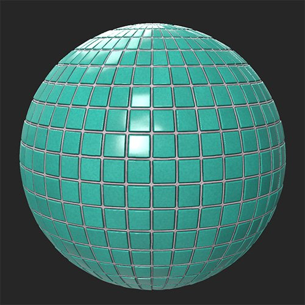

# 色相/饱和度

<table>
<tr style="border: 0;">
<td width="41.60%" style="border: 0;" valign="top">

**进入：**&#x200B;调整

</td>
<td width="58.30%" style="border: 0;" valign="top">

## 描述

“色相/饱和度”滤镜允许您调整base color和扩散通道的颜色。 您还可以使用蒙版专门修改图像某些部分的颜色。

下图显示了用于调整拼贴材料的色相的&#x200B;**色相/饱和度滤镜**。

<table>
<tr style="border: 0;">
<td style="border: 0;" valign="top">

{width="200px"}

</td>
<td style="border: 0;" valign="top">

{width="200px"}

</td>
</tr>
</table>

</td>
</tr>
</table>

## 参数

**基本参数**

* **色相**： -1到1\
  调整图像的色相 — 这对于在“图像到材料”工作流程中校正颜色非常有用。
* **饱和度**： -1到1\
  调整饱和度以突出颜色，或降低颜色强度。
* **明亮度**： -1到1\
  修改颜色的明亮度。
* **着色**：切换\
  禁用后，滤镜将调整现有的颜色。 启用后，此滤镜将基于“色相”、“饱和度”和“明亮度”滑块替换颜色，同时保持细节。

**蒙版**

* **使用自定义蒙版**：切换\
  启用或禁用自定义蒙版的使用。 如果启用，将显示以下参数：
  * **蒙版**：图像/画笔\
    选择要用作蒙版的图像，或使用画笔直接在2D 视图中绘画自定义蒙版
  * **自定义蒙版 — 模糊**： 0-1\
    模糊蒙版
  * **自定义蒙版 — 反转**：切换\
    反转蒙版
