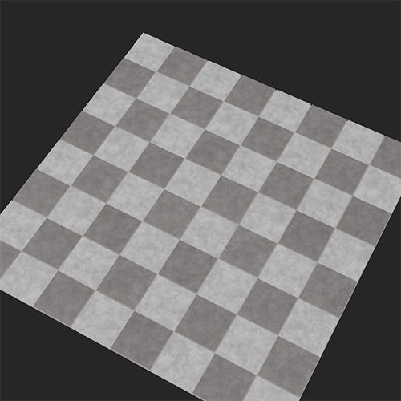

# 地板拼贴

<table>
<tr style="border: 0;">
<td width="41.60%" style="border: 0;" valign="top">

**英寸：**&#x200B;生成器

</td>
<td width="58.30%" style="border: 0;" valign="top">

## 描述

“地板拼贴”滤镜分解底层素材，并将其转换为“地板拼贴”的排列方式。

下图显示了转换为棋盘图案的地板拼贴的混凝土材料。

<table>
<tr style="border: 0;">
<td style="border: 0;" valign="top">

{width="200px"}

</td>
<td style="border: 0;" valign="top">

{width="200px"}

</td>
</tr>
</table>

</td>
</tr>
</table>

参数

<b>基本参数</b>

* <b>随机植入</b>： \
  随机种子确定在此过滤器中使用随机性的其他参数的随机值。
* <b>材质数量</b>： \
  更改要转换为地砖的材质数量。 第一材料由地板拼贴滤镜层下面的层确定。 如果选择此选项，则可以将第二个字段添加为输入字段
* <b>输入材质强度</b>： 0-1 \
  在拼贴中能够看到输入素材细节的程度
* <b>反转素材</b>：切换 \
  使用两种材质时，交换它们在拼贴中出现的位置。
* <b>颜色变化</b>： 0-1 \
  同一材质的每个拼贴之间的颜色差异量
* <b>斜面半径</b>： 0-1 \
  瓷砖的大小与砂浆的大小
* <b>斜角深度</b>： 0-1 \
  迫击炮的深度
* <b>斜角圆度</b>： 0-1 \
  确定拼贴的外角
* <b>表面颗粒</b>： 0-1 \
  确定原始素材的细节在拼贴的法线和Height图上显示的程度
* <b>图案蒙版</b>：输入。  \
  每个地板拼贴图案蒙版都有一组不同的可用参数。 此处我们仅覆盖<b>方形拼贴</b>可用的参数

  * <b>随机植入</b>\
    随机种子确定在此过滤器中使用随机性的其他参数的随机值。
  * <b>X数量</b>\
    调整拼贴列数
  * <b>Y数量</b> \
    调整拼贴的线条数
  * <b>渐变</b> \
    调整与砂浆尺寸相比的瓷砖尺寸的比例。
  * <b>明亮度随机</b>\
    由于明亮度影响Height图，因此此参数会随机移除一些拼贴
  * <b>图案旋转</b>： 0-1 \
    旋转拼贴的角度，使其彼此远离以避免重叠
  * <b>形状缩放：</b> 0-1 \
    调整与砂浆尺寸相比的瓷砖尺寸的比例。
  * <b>形状缩放随机</b>\
    随机添加拼贴大小的一些差异
  * <b>形状大小</b>\
    调整拼贴的长度和宽度
  * <b>形状大小随机</b>\
    为拼贴的长度和宽度添加一些随机性
  * <b>位置偏移模式</b>：下拉列表
  * <b>位置偏移</b>\
    随机移动拼贴列，使拼贴不水平对齐
  * <b>位置随机</b> \
    将拼贴随机放置在表面上，拼贴之间有一些位叠加
  * <b>形状旋转</b>\
    沿同一方向旋转拼贴的角度，同时使拼贴保持尽可能接近电位叠加
  * <b>形状旋转随机</b>\
    随机旋转拼贴的角度，同时以势叠加的方式尽可能保持拼贴的接近

<b>间隙</b>

* <b>间隙颜色</b>：颜色选择 \
  更改拼贴之间的颜色
* <b>间隙粗糙度</b>： 0-1 \
  更改拼贴之间素材的粗糙度值。
* <b>间隙金属</b>： 0-1 \
  更改拼贴之间材料的金属值。
* <b>间隙Height</b>： 0-1 \
  更改拼贴之间素材的Height值。
* <b>间隙不规则</b>： 0-1 \
  调整砂浆在瓷砖之间的粘贴程度。

<b>年龄</b>

* <b>地板倾斜</b>：0-1 \
  向随机拼贴添加一些倾斜
* <b>Height随机</b> \
  以随机方式添加拼贴之间的Height差异
* <b>Dirt</b>： 0-1 \
  为拼贴和间隙添加Dirt
* <b>损坏</b>： 0-1 \
  从每个拼贴的斜角的边缘随机移除一些分片
* <b>瑕疵</b> \
  在拼贴中添加小孔和瑕疵

<b>技术参数</b>

* <b>材质缩放</b>： 0-1 \
  拼贴内的素材缩放
* <b>正常强度</b>： 0-1 \
  调整间隙、拼贴和内部素材的法线强度

<b>使用指南</b>

利用“地板拼贴”滤镜，您可以快速将素材转换为拼贴。 大多数“地板拼贴”滤镜的使用都非常简单，除非使用了多种材质。 要使用两种材质：

1. 将<b>基本参数>材质数量</b>设置为2。
1. 将第二种素材拖到图层栈叠中地板拼贴滤镜下方的输入插槽中。
1. 调整输入素材的参数，直到您对结果满意为止。

虽然可以将多种素材和滤镜添加到单个输入插槽中，但通常最好避免这样做，因为这会增加复杂性，并在稍后返回时使阅读素材更困难。 而是在项目中创建新素材，然后将新素材的实例拖入输入槽。 当您更新项目中的素材时，它将自动更新输入插槽中的素材，让您能够完全控制并简化图层栈栈。
