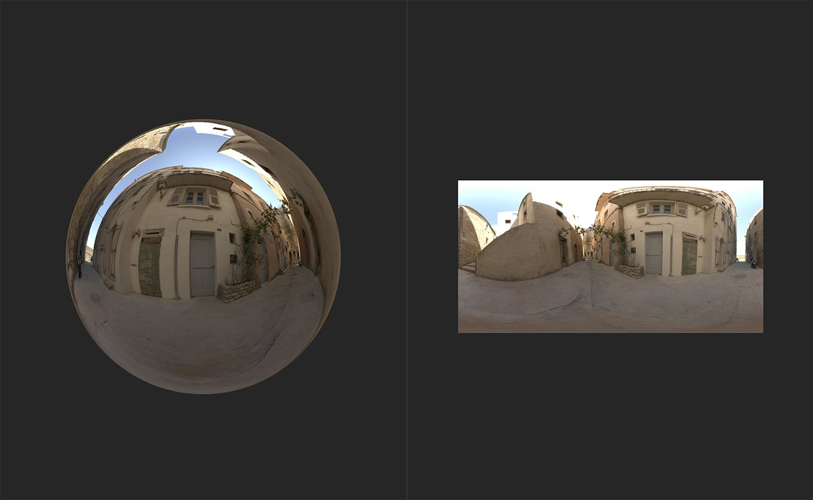

# Exposure

<table>
<tr style="border: 0;">
<td width="41.60%" style="border: 0;" valign="top">

**进入：**&#x200B;个HDRI 工具

</td>
<td width="58.30%" style="border: 0;" valign="top">

## 描述

修改环境光的曝光度。

以下图像显示了如何使用&#x200B;**曝光度滤镜**&#x200B;来调整您的环境光。

上图显示了添加&#x200B;**曝光度滤镜**&#x200B;之前的环境光。

使用&#x200B;**曝光度滤镜**，提高了环境的曝光度，使其看起来更加明亮。 因此，更多光线在&#x200B;**3D视图**&#x200B;中从球体反射。

</td>
</tr>
</table>

## 参数

**基本参数**

* **曝光度(EV)**： -8至8\
  调整环境光的曝光度。 EV代表曝光值，是一个摄影术语，用于表示快门速度和光圈的组合。
