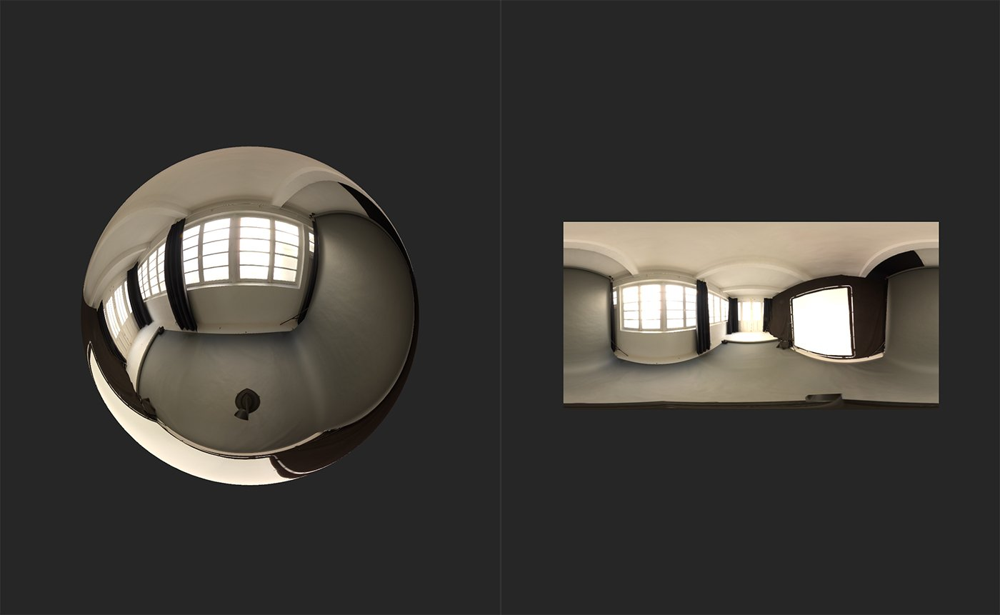

# Nadir Patch

<table>
<tr style="border: 0;">
<td width="41.60%" style="border: 0;" valign="top">

**进入：**&#x200B;个HDRI 工具

</td>
<td width="58.30%" style="border: 0;" valign="top">

## 描述

修补环境光的谷底，以隐藏伪影或接缝。

在下图中，您可以看到如何使用&#x200B;**Nadir Patch**&#x200B;移除此全景图像中的相机支架。

</td>
</tr>
</table>

## 参数

**基本参数**

* **启用**：切换\
  打开或关闭修补程序 — 这有助于快速查看修补程序的影响，而无需更改图层可见性。
* **显示助手**：切换\
  打开或关闭帧。
* **帧Thickness**： 0-1\
  调整帧的Thickness。 当修补源远离最低点时，此功能非常有用。
* **修补程序缩放**： 0-1\
  调整要修补的区域的边界。
* **修补程序大小**：\
  调整修补的尺寸。
* **修补程序旋转**： 0-1\
  旋转曲面片边界。 这将旋转源位置和修补程序位置，以便修补程序仍然具有相同的方向。 要就地旋转修补，请使用&#x200B;**源旋转偏移**。
* **修补Alpha**：\
  选择用于遮盖修补的形状。 如果选择&#x200B;**蒙版输入**，将显示其他参数：
  * **蒙版输入**：图像/画笔\
    导入图像以用作蒙版，或直接在&#x200B;**2D 视图**&#x200B;中绘画蒙版。
* **修补硬度**： 0-1\
  调整修补蒙版边缘的模糊效果。
* **源旋转偏移**： 0-1\
  偏移源的旋转 — 这会产生旋转修补的效果。

## 使用指南

从照片创建环境光时，纹理的顶部和底部底部周围会出现伪影，这是经常出现的问题。 **Nadir Patch** **筛选器**&#x200B;有助于最大限度地减少这些问题。

1. 将&#x200B;**Nadir Patch筛选器**&#x200B;添加到图层堆叠顶部。
1. 使用&#x200B;**2D 视图**&#x200B;中的句柄更改修补程序的源位置。
   1. 修补后的最低点会随源位置而变化。 如果源文件位于纹理空间的下半部分，则会修补底部最低点；如果源文件位于上半部分，则会修补顶部最低点。
1. 修改参数以微调修补程序的变换，从而更好地隐藏接缝和伪影。
