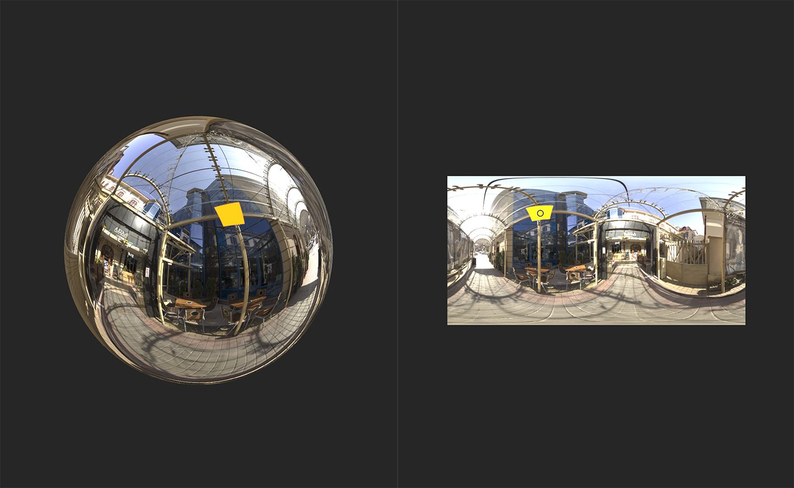

# 平面光

<table>
<tr style="border: 0;">
<td width="41.60%" style="border: 0;" valign="top">

**进入：**&#x200B;个HDRI 工具

</td>
<td width="58.30%" style="border: 0;" valign="top">

## 描述

向环境添加平面形状的光。

</td>
</tr>
</table>

## 参数

**基本参数**

* **曝光(EV)**： 0-10\
  调整光线的曝光度或亮度。
* **形状颜色模式**：\
  选择用于确定光线颜色的方法。 可用参数将基于此选择而更改。
  * **温度（开氏温度）**
    * **温度**： 1000 - 27000\
      调整光线的色温。
  * **RGB**
    * **颜色**：颜色选择\
      选择光线的颜色。
  * **图像输入**
    * **形状图像输入**：图像/画笔\
      导入要用作颜色的图像。 您可以使用画笔工具直接在&#x200B;**2D视图**&#x200B;中绘画，但使用此滤镜可能会产生无法预料的结果。
  * **示例背景**
    * 取样背景无法使新参数可用，而是将浅色基于背景值。
* **位置模式**：\
  更改确定光源位置的方法。 **位置坐标**&#x200B;部分中的参数将根据选择而更改。 选择&#x200B;**世界位置**&#x200B;后，手柄将从&#x200B;**2D视图**&#x200B;中消失，而是使用&#x200B;**位置坐标**&#x200B;中的参数来修改光线的位置。

**形状**

* **平面比例**；0-1\
  调整光线比例。
* **平面大小**： 0-1\
  调整光线在X轴和Y轴中的尺寸。
* **平面旋转**： 0-1\
  调整光线沿X、Y和Z轴的旋转。
* **图案**：\
  选择光线的形状。
* **图案硬度**： 0-1\
  柔化或模糊光线的边缘
* **图案UV模式**：\
  选择变换是拉伸整个形状还是仅拉伸形状的中间部分以保持边缘和角落细节。

**位置坐标**

可用参数取决于为&#x200B;**基本参数>位置模式**&#x200B;所做的选择。 如果选择&#x200B;**接地/天花板**&#x200B;或&#x200B;**距原点距离**，则可以使用以下参数：

* **行绝对Height**： 0-1\
  更改光线与相机的距离。
* **相机位置**： 0-1\
  在X、Y和Z轴上调整相机与光线的相对位置。

如果在&#x200B;**基本参数>位置模式**&#x200B;中选择了&#x200B;**全局位置**，则以下参数可用：

* **向上矢量**：\
  改变朝上的方向。
* **点1世界位置**： -2到2\
  在X、Y和Z轴上调整线条的第一个点的位置。
* **点2世界位置**： -2到2\
  调整直线第二点在X、Y和Z轴上的位置。
* **相机位置**： 0-1\
  在X、Y和Z轴上调整相机与光线的相对位置。

**背景**

* **显示地网格**：切换\
  显示或隐藏地网格。
* **启用地面剪切**：切换\
  选择光线是否可以穿过地面。 如果启用，将显示以下控件：
  * **地面Height**： -2到2\
    调整地面Height以剪切光线。
* **背景灰度系数**：\
  选择用于确定背景灰度系数的颜色系统。
