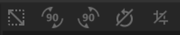

# 裁剪工具

<table>
<tr style="border: 0;">
<td width="41.60%" style="border: 0;" valign="top">

**在：**&#x200B;个工具中

</td>
<td width="58.30%" style="border: 0;" valign="top">

## 描述

使用&#x200B;**裁剪工具**&#x200B;调整图像或材料的裁剪。 **裁剪工具**&#x200B;的工作方式非常类似于&#x200B;**变换工具**。 使用&#x200B;**变换工具**&#x200B;时，对变换框的更改会对基础图像产生一对一的影响，因此增加变换框的缩放比例会增加基础图像的大小。 使用&#x200B;**裁剪工具**&#x200B;时，此关系会反转，增加裁剪框的大小可减少底层图像的大小。 因此，在使用&#x200B;**裁剪工具**&#x200B;时，设置&#x200B;**2D视图**&#x200B;以显示图层输入（而不是默认的素材输出）会很有帮助。

**裁剪工具**&#x200B;可用于调整具有非标准长宽比的图像。 例如，您可以使用裁剪工具，通过&#x200B;**属性面板**&#x200B;中的输入大小参数，调整导入图像的比例。

>[!NOTE]
>
> 请注意，**裁剪工具**&#x200B;既可以处理图像，也可以处理素材。 如果&#x200B;**裁剪图层**&#x200B;下的图层栈栈中存在图像或扫描通道，则&#x200B;**裁剪滤镜**&#x200B;将应用于扫描通道。 如果没有图像或扫描通道，则&#x200B;**裁剪滤镜**&#x200B;将改为修改素材。

在下图中可以看到&#x200B;**裁剪工具**&#x200B;正在使用。

请注意，2D视图设置为显示图层输入，以便&#x200B;**2D视图**&#x200B;中的手柄显示将哪些输入区域变为输出。

</td>
</tr>
</table>

## 参数

**基本参数**

* **输入大小**： 0-8192\
  在X轴和Y轴上调整输入的大小（以像素为单位）。

**高级参数**

* **筛选**：\
  选择应用于调整大小后的像素的滤镜方法。 两次线性滤波会将像素相互模糊处理，而最近一次滤波会保留像素的边缘。
* **裁剪变换**： 0-1\
  修改变换的矩阵值。 编辑这些值可以更精确地控制旋转和缩放，还可以使裁剪手柄倾斜。
* **裁剪偏移**： 0-1\
  从起始位置偏移裁剪。

## 使用指南

>[!NOTE]
>
> “裁剪”滤镜有自己的分辨率，它将根据裁剪的材料或图像裁剪并输出足够的分辨率。 要保持最佳结果，请将以上图层放在“输入最大值”中，然后使用“放大”来放大最终结果。

单击&#x200B;**裁剪工具**，在图层栈叠顶部添加新的裁剪滤镜图层。

创建或选择裁剪滤镜图层将自动打开&#x200B;**2D视图**。 选择“裁剪”图层后，**2D视图**&#x200B;的顶部将显示一个工具栏。

## 功能

>[!NOTE]
>
> “裁剪”滤镜执行您请求的移动、缩放或旋转的反向操作。 如果您发现“裁剪”滤镜感觉不正确，您可能会发现“变换”滤镜更有用。

### 移动

要移动图层：

1. 将鼠标悬停在变换框内
1. 光标将变为四个箭头
1. 单击并拖动以移动变换框。

### 比例

缩放图层：

1. 将鼠标悬停在变换框边缘或角处的手柄上
1. 光标将变为四个箭头。
1. 单击并拖动以缩放变换框。

>[!NOTE]
>
> 通过变换框角上的手柄，您可以一次在二维中进行缩放，而变换框边缘上的手柄将限制您在一个维中进行缩放。

### 旋转

要旋转图层，请执行以下操作：

1. 将鼠标悬停在变换框外部但位于&#x200B;**2D视图**&#x200B;内。
1. 光标旁边将出现一个水平的小箭头。
1. 单击并拖动以旋转变换框。

>[!NOTE]
>
> 您可以通过拖动变换框中心的小圆圈来更改旋转中心。 变换框始终围绕此圆旋转。

## 工具栏

{width="200px"}

工具栏包含以下快捷键：

* 方形化：调整当前变换的缩放比例以使其变为方形。
* 旋转+90°（向右）：顺时针90°旋转。
* 旋转–90°（向左）：逆时针90°旋转。
* 重置旋转中心：将旋转中心重置为变换框的中心。
* 重置变换：将变换工具重置到默认位置。
