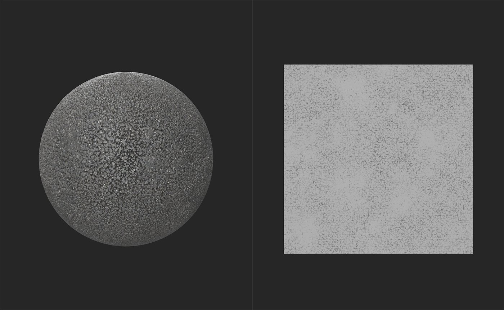

# 对AO的Height

<table>
<tr style="border: 0;">
<td width="41.60%" style="border: 0;" valign="top">

**在：**&#x200B;个工具中

</td>
<td width="58.30%" style="border: 0;" valign="top">

## 描述

根据Height和常规数据生成环境遮蔽图。

在以下图像中查看&#x200B;**Height到AO筛选器**&#x200B;的结果。

在上图中，**2D视图**&#x200B;显示Height地图。 该材质未包含此图像中的任何环境遮蔽信息。

在此图像中，**Height到AO滤镜**&#x200B;创建了环境遮蔽映射，并且在&#x200B;**2D视图**&#x200B;中可见。 环境遮蔽通常是一种很细微的效果，因此在此素材中不太容易看到 — 请尝试在素材上使用&#x200B;**Height进行AO滤镜**&#x200B;以增强AO强度，并给人一种使用环境遮蔽的感觉。

</td>
</tr>
</table>

## 参数

**基本参数**

* **模式**：\
  选择是从Height声道、普通声道还是同时从两个声道生成数据。
* **环境遮蔽 — 强度**： 0-1\
  调整生成的AO数据的强度
* **环境遮蔽 — 扩散**： 0-1\
  调整生成的AO数据的半径
