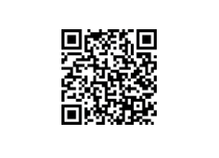

# 图像到材料

**图像到材料**&#x200B;模板允许从单个输入图像生成高质量的PBR材料。

此模板有两个主要算法：

* **AI支持**
* **B2M**

有关每种算法的详细说明，请参阅下文。

## 示例

以下是从单个输入图像生成的材料声道的示例：

{width="500px"}

## 算法

要将&#x200B;**图像到材料**&#x200B;模板的算法更改，请单击模板名称下方的下拉列表：

### 由AI提供支持

<b>AI支持</b>算法使用机器学习来识别形状和对象，并准确生成、正常、Height和粗糙度地图，以及去除任何阴影或高光中的反照率。

神经网络已经接受过在织物、有机物、室内和室外表面等各种材料上的训练。

>[!NOTE]
>
> 在高分辨率图像上计算“图像到材料”（由AI提供支持）将需要更长的时间，我们建议您在工作时使用[图层分辨率](../../interface/preferences/layer-resolution.md)系统来优化工作流程。

### B2M

**B2M**&#x200B;算法使用基于Substance的位图来材料方法，以使用程序化的技术生成多个通道，例如base color、正常、金属、粗糙度和ambient occlusion。

此算法产生的结果可能不太准确，但适用于更广泛的输入图像。

## Adobe Capture

Adobe Capture移动应用程序（Android和iOS）上也提供了此功能。 您可以随时随地捕捉照片，并直接在手机上预览效果。

轻松将结果发送到Substance 3D Sampler以进行进一步编辑。

>[!NOTE]
>
> 此功能仅适用于Adobe版Substance 3D Collection订阅。
