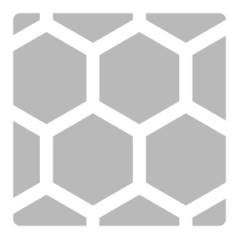
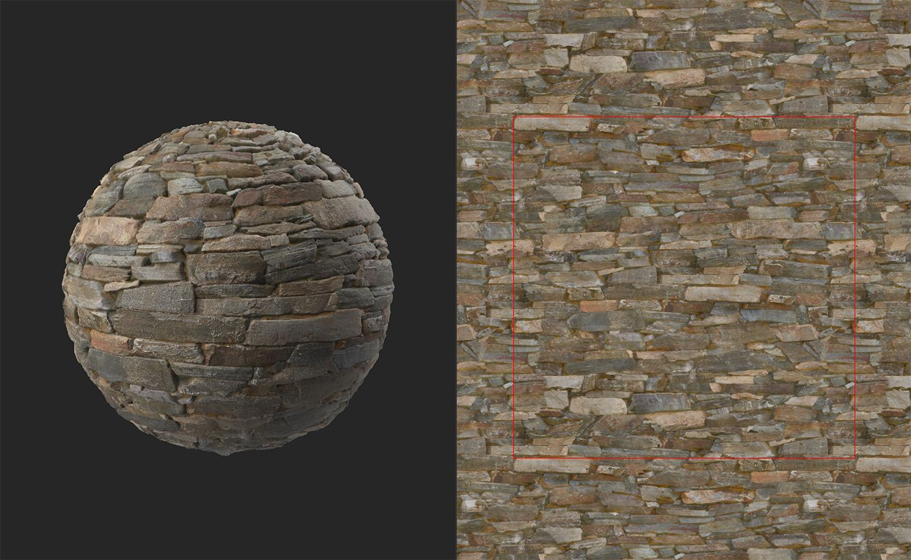

# 使其平铺

<table>
<tr style="border: 0;">
<td width="41.60%" style="border: 0;" valign="top">

**英寸：**&#x200B;生成器

</td>
<td width="58.30%" style="border: 0;" valign="top">

## 描述

使用&#x200B;**使其平铺筛选器**&#x200B;使您的材料可平铺。 **拼贴筛选器**&#x200B;也使您的材料可平铺，但每个筛选器的工作方式不同。 如果您发现&#x200B;**使其为磁贴滤镜**&#x200B;不起作用，请尝试&#x200B;**拼贴滤镜**。

在下图中，您可以看到&#x200B;**使其为平铺筛选器**&#x200B;如何将非材料转换为平铺材料。 此材料拼贴效果很好，因为它遵循类似网格的图案，并且没有特定的点来吸引焦点。

在上图中，红线显示材料的边界。 很明显，存在一个强大的接缝，而这个材料并不平铺。

在&#x200B;**使其拼贴**&#x200B;后，此材料拼贴良好，并且没有红线，将不可能在材料的边界处看到接缝。

</td>
</tr>
</table>

## 参数

**基本参数**

* **阈值**： 0-1\
  调整顶部图层的大小和匹配。
* **Smoothness**： 0-1\
  平滑顶部图层的接缝。
* **对比度**： 0-1\
  调整接缝的对比度。 降低对比度与模糊接缝具有相同的效果。
* **污点去除**：切换\
  如果启用，滤镜将尝试移除顶部和底部图层之间接缝附近的伪像。
* **Color Equalizer**： 0-50\
  使颜色值色调均化以降低接缝的可见性。
* **Height匹配**：\
  更改滤镜顶部和底部图层的Height映射混合方式。 若要更清楚地查看结果，请查看&#x200B;**2D 视图**&#x200B;中的Height频道。 请注意，Height匹配不会影响Height声道以外的声道，因此法线和AO不会受Height匹配更改的影响。

**高级参数**

* **色度影响**： 0-1\
  调整颜色值对接缝的影响程度。
* **蒙版反转**：切换\
  反转顶部和底部图层蒙版。
* **Height匹配Smoothness**： 0-16\
  调整顶部和底部图层之间的Height匹配模糊。
* **左/右修补程序源**： -1到1\
  调整左侧和右侧修补程序的源位置。
* **顶部/底部修补程序源**： -1到1\
  调整顶部修补程序和底部修补程序的源位置。

## 使用指南

**使其平铺** **滤镜**&#x200B;的工作方式是将材料的多个副本叠加在另一个副本之上。

下图显示了图层的布局：

* 绿色周边显示&#x200B;**使其平铺滤镜**&#x200B;中生成的材料的边缘
* 红线显示底部图层的边框。 底部图层与X和Y轴上的UV空间相偏移50%，因此红线是需要覆盖的拼贴接缝。
* 蓝色正方形和半圆形将覆盖红色接缝。 此滤镜的参数允许您调整蓝色形状的边框，以确保红色接缝不可见，同时使蓝色接缝尽可能平滑。

{width="512px"}

左右半圆相互匹配以确保材料拼贴水平排列，而顶部和底部半圆确保材料拼贴垂直排列。 中间的蓝色方块将移除隐藏所有剩余的接缝，以创建一个没有接缝的完全可平铺的材料。
