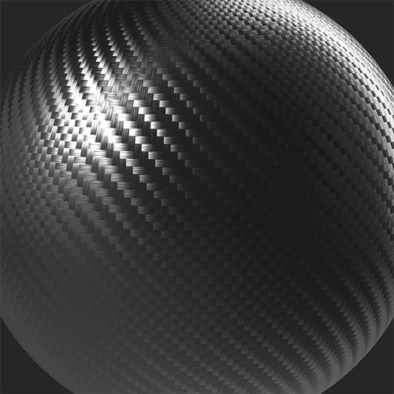

# 匹配

<table>
<tr style="border: 0;">
<td width="41.60%" style="border: 0;" valign="top">

**在：**&#x200B;个工具中

</td>
<td width="58.30%" style="border: 0;" valign="top">

## 描述

**匹配滤镜**&#x200B;允许您将素材的颜色和粗糙度与所选参数或其他素材相匹配。

下图显示了正在使用&#x200B;**匹配筛选器**&#x200B;通过调整基色将碳纤维材料转换为图案化金。

<table>
<tr style="border: 0;">
<td style="border: 0;" valign="top">

{width="200px"}

</td>
<td style="border: 0;" valign="top">

{width="200px"}

</td>
</tr>
</table>

</td>
</tr>
</table>

## 参数

**基本参数**

* **目标模式**：\
  选择是要与输入材质匹配还是要与自定义参数匹配。 可用参数取决于选择了哪个&#x200B;**目标模式**。
  * **输入**
    * **半径**： 0-50\
      调整匹配区域的半径
    * **预设**：\
      选择是只匹配颜色，还是同时匹配颜色和粗糙度。 此选择更改&#x200B;**高级参数**&#x200B;中可用的选项
  * **参数**
    * **预设**：\
      选择是只匹配颜色，还是同时匹配颜色和粗糙度。 此选择更改&#x200B;**高级参数**&#x200B;中可用的选项
    * **基色**：颜色选择\
      选择要匹配的颜色
    * **粗糙度**： 0-1\
      将粗糙度设置为匹配

**高级参数**

* **输入平铺**：切换\
  如果输入拼贴以改善素材边缘的匹配，请启用此选项
* **基色 — 匹配目标**： 0-1\
  调整基色匹配的强度
* **粗糙度 — 匹配目标**： 0-1\
  调整粗糙度匹配的强度
