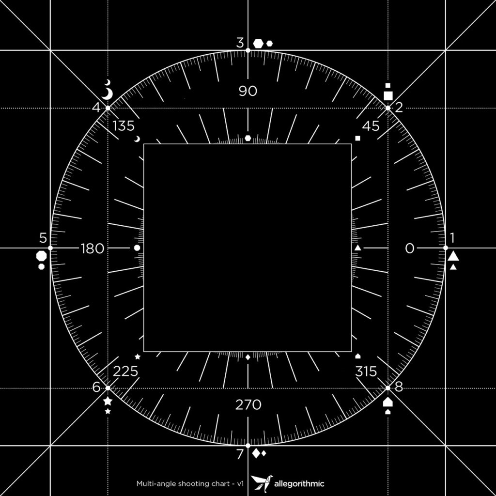

# 多角度转材质

**多角度转材质**&#x200B;模板创建了在特定光照条件下拍摄的2到8个输入图像的材料。 这样的光条件可以通过材料扫描仪来实现。

>[!NOTE]
>
> 您可以在文章](https://www.adobe.com/products/substance3d/magazine/your-smartphone-is-a-material-scanner-vol-ii.html)中查找有关如何创建自己的素材扫描仪[的更多信息。

## 示例

以下是从8个输入图像创建的材料的示例：

* 前8幅图像为在8个光角度下拍摄的扫描图像。
* 底部图像是模板的输出（基色、正常、Height、金属色和粗糙度）。

{width="400px"}

## Substance 3D Sampler配置

要设置和配置3个步骤以确保PBR通道正确提取：

* 扫描图像的顺序
* 第一输入光角
* 下一个输入光角度

{width="450px"}

### 扫描图像的顺序

导入图像时，请在“图像导入图层”中验证这8张图像是否连续。

例如，第一个0°的图像应为&#x200B;**scan1**，而45°的图像应为&#x200B;**scan2** ...然后315°的图像应为&#x200B;**scan8**

{width="450px"}

### 第一个和下一个光源角度

在多角度转材质图层中：

* 设置第一个输入光角度。 如果您的&#x200B;**scan1**&#x200B;处于180°，则第一个输入光角度=0.5；如果您的&#x200B;**scan1**&#x200B;处于0°，则第一个输入光角度= 0
* 设置下一个输入光角度：它定义图像的旋转方向。 如果scan1为0°，scan2为45°...值为&#x200B;**逆时针**

{width="450px"}
