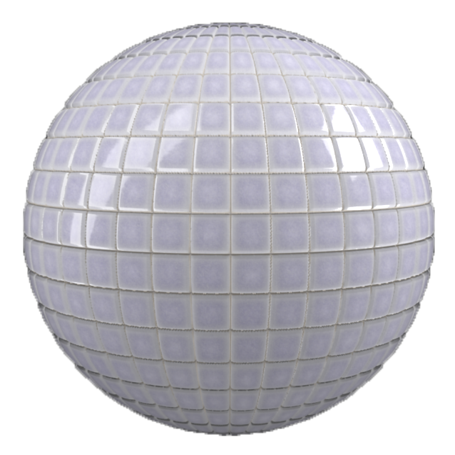
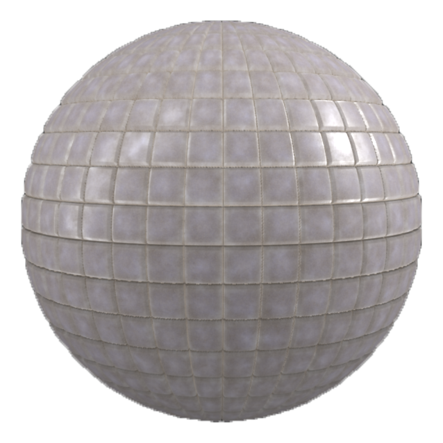

# 污垢

<table>
<tr style="border: 0;">
<td width="41.60%" style="border: 0;" valign="top">

**英寸：**&#x200B;磨损和磨光

</td>
<td width="58.30%" style="border: 0;" valign="top">

## 描述

使用&#x200B;**Dirt筛选器**&#x200B;在素材上添加Dirt。 **Dirt滤镜**&#x200B;非常适合使素材看上去更老旧、更不必担心。

将上面的空白拼贴与下面应用于它们的Dirt滤镜进行比较。

</td>
</tr>
</table>

## 参数

<b>基本参数</b>

* <b>随机植入</b>： \
  随机种子确定在此过滤器中使用随机性的其他参数的随机值。

* <b>Dirt跨页</b>： 0-1 \
  控制Dirt所覆盖的表面区域的范围

* <b>顶部Dirt跨页</b>： 0-1\
  控制Dirt所覆盖的顶部表面，不关注材料的折痕

* <b>Dirt对比度</b>： 0-1 \
  调整不同Dirt杂点之间的对比度级别，以控制Dirt与底层素材混合的方式。

* <b>Dirt不透明度</b>： 0-1 \
  控制基色通道中Dirt的透明度级别。 1完全不透明。

* <b>Dirt颜色</b>： 0-1 \
  选择Dirt的颜色。

* <b>Dirt粗糙度</b>： 0-1 \
  调整光线在素材表面的散点方式

* <b>Dirt金属</b>： 0-1 \
  定义Dirt表面的反射程度

* <b>Height</b>： 0-1 \
  控制Dirt对Height图的影响

* <b>Dirt的正常强度</b>： 0-1 \
  控制Dirt级别对法线图的影响程度

* <b>使用表面瑕疵</b>：切换 \
  启用或禁用表面缺陷的使用。 如果启用，将显示其他控件：

  <b>表面瑕疵</b>：图像 \
  导入图像以用作表面瑕疵，或使用Sampler资源库中默认提供的纹理生成器之一，例如“污渍”或“黑点”
