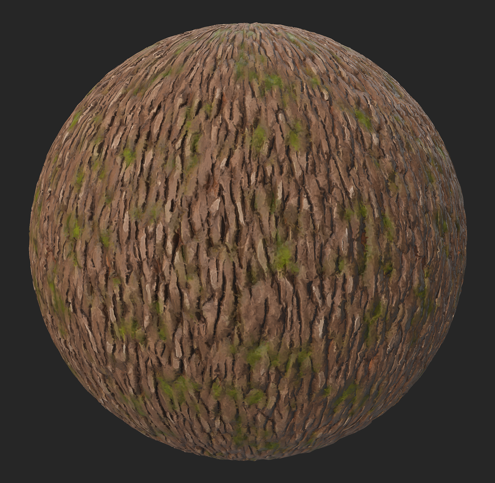

# 风格化

<table>
<tr style="border: 0;">
<td width="41.60%" style="border: 0;" valign="top">

<b>英寸：</b>磨光表面

</td>
<td width="58.30%" style="border: 0;" valign="top">

## 描述

使用<b>风格化滤镜</b>修改您的材料外观，以便用不同的效果简化细节。

下图显示了应用风格化滤镜之前和之后的树皮材料。

</td>
</tr>
</table>

## 预设

<b>风格化</b>

    默认预设通过模糊化微小细节和提高对比度来应用柔和的风格化效果

<b>对比风格</b>

    此预设将类似画笔描边的效果应用于材料

<b>绘画</b>

    此预设将模糊且柔和的画笔描边效果应用于材料

<b>手绘</b>

    此预设应用比上一个预设更多的对比度，它模仿水粉或油画绘画手动画笔描边

## 基本参数

* <b>随机植入</b>\
  此滤波器中所有其他随机参数所基于的随机植入。

* <b>全局滤镜强度</b>： 0-1 \
  调整此滤镜的效果将在原始材料上应用的程度。 设置为1可应用完整效果。

* <b>对比度</b>： 0-1 \
  修改应用于材料的对比度级别

* <b>颜色风格化强度</b>： 0-1 \
  调整滤镜的风格化效果将对材料颜色产生多大影响

* <b>粗糙度风格化强度</b>： 0-1 \
  调整滤镜的风格化效果对粗糙度的影响程度

* <b>金属风格化强度</b>： 0-1 \
  调整滤镜的风格化效果将在多大程度上影响材料的金属性

* <b>Height风格化强度</b>： 0-1 \
  调整滤镜的风格化效果对Height的影响程度

* <b>正常风格化强度</b>： 0-1 \
  调整滤镜的风格化效果将对材料正常产生多大影响

## 基础颜色

* <b>着色强度</b>： 0-1 \
  更鲜艳的颜色

* <b>着色颜色</b>：颜色 \
  让您选取“着色强度”参数趋于的颜色。

* <b>颜色变化强度</b>： 0-1 \
  调整颜色强度受“颜色变化”中定义的颜色影响的程度

* <b>颜色变化</b>：颜色 \
  选择用于驱动“颜色变化强度”滑块的颜色

* <b>颜色变化对比度</b>： 0-1 \
  调整在“颜色变化”中定义的颜色的对比度

* <b>空腔颜色强度</b>： 0-1 \
  调整在材料的凹陷区域出现的颜色的强度，该颜色已在“Cavity Color”中定义

* <b>空腔颜色</b>：颜色 \
  定义将应用于材料凹陷区域的颜色

* <b>空腔范围</b>： 0-1 \
  定义下沉区域在材料中的宽度。

* <b>模穴模糊</b>： 0-1\
  调整材料型腔边缘区域的模糊程度

* <b>弯曲强度</b>： 0-1 \
  修改材料的最高点的可见程度，用“曲率颜色”参数中定义的颜色着色

* <b>弯曲着色强度</b>： 0-1 \
  调整“颜色颜色”参数中定义的弯曲的不透明度

* <b>弯曲颜色</b>：颜色 \
  定义将应用于材料最高点的颜色

* <b>曲率模糊</b>： 0-1 \
  调整由“弯曲颜色”参数着色的区域周围的模糊级别

## 垃圾摇滚

* <b>污渍强度</b>： 0-1 \
  在材料顶部添加一个污渍图。 可以在下面选择污渍映射。

* <b>污渍颜色</b>：颜色 \
  选择将用于应用所选污渍映射的颜色

* <b>污渍粗糙度</b>： 0-1 \
  调整将应用于所添加的污渍映射的级别或粗糙度

* <b>金属</b>： 0-1 \
  调整将应用于所添加的污渍映射的金属性级别

* <b>粗糙度变化</b>： 0-1 \
  选择应用于所添加污渍图的粗糙度中的变化级别

* <b>粗糙度变化强度</b>： 0-1 \
  选择应用于添加污渍映射的变化强度的变化级别

* <b>污渍</b>：图像 \
  选择可在Sampler资源库中找到的图像或纹理生成器以用作污渍地图

## 技术参数

* <b>锐化强度</b>： 0-1 \
  调整全局锐化效果的强度

* <b>锐化半径</b>： 0-1 \
  调整全局锐化效果的半径

* <b>重新计算normal</b>：切换 \
  允许Sampler在应用于材料的更改后重新计算正常值

* <b>正常强度</b>： 0-1 \
  调整法线图的强度

* <b>正常柔化</b>： 0-1\
  柔化正常区域，使材料看起来更平滑

* <b>Ambient occlusion强度</b>： 0-1\
  调整AO地图上的对比度级别
