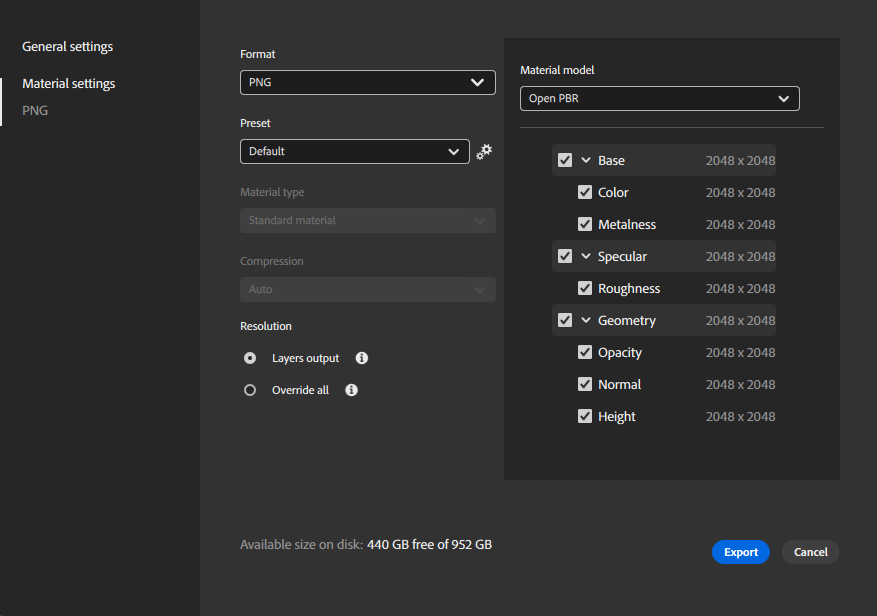
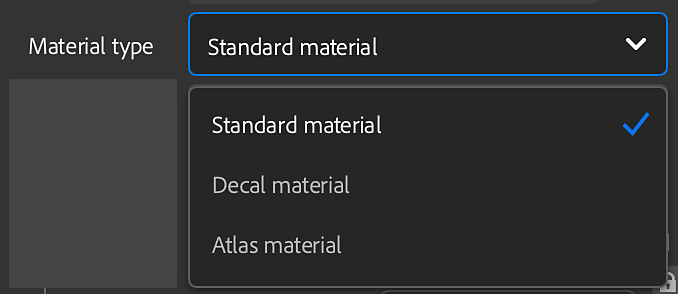

# 导出窗口

您可以从<b>右边栏</b>中的<b>导出</b>面板导出资源。

导出选项取决于要导出的资源的类型。

材料导出的“导出”窗口。

>[!NOTE]
>
> 导出面板还提供将资源发送到Substance 3D Designer、Painter或Stager的选项。 这将自动用适用于其他Substance 3D应用程序的正确设置导出您的资源。

## 常规设置

以下设置适用于所有资源类型。

* <b>名称： </b>此字段定义您要导出的资源的名称。 它将在导出文件的文件名中用作前缀。
* <b>保存到： </b>选择资源的导出目标。 您也可以选择在所选位置创建子文件夹。 如果启用此选项，子文件夹将按照您的资源命名。

## 材质设置

导出材质时，“导出”窗口的“材质设置”面板具有以下选项：

* <b>格式</b>：为导出的资源选择文件格式。
  * <b>SBSAR</b>：导出您的素材以在支持Substance素材的任何应用程序中使用。
  * <b>SBS</b>：导出您的素材，以便可以在Substance 3D Designer中打开。
  * <b>EXR、JPEG、PNG、TARGA、TIFF</b>：将您的素材导出为图像文件集合。

>[!NOTE]
>
> 普通声道和Height声道的位深度将被强制设置为16位。 其他声道将以8/16位导出，具体取决于您的素材和资源使用的滤镜。 根据文件格式，可以更改位深度，因为某些文件格式不支持高位深度。

{width="400px"}

* <b>预设</b>(EXR、JPEG、PNG、TARGA、TIFF)：选择一个预设，为给定应用程序或管道自动设置文件导出。
  * <b>默认（项目工作流）</b>选项显示您的素材的所有可用通道的列表，而不应用任何预设。
  * 使用“预设”参数右侧的<b>管理预设</b>按钮可编辑预设或添加您自己的预设。<b> </b>
  * [此处提供了有关预设的更多信息。](../managing-presets.md)

>[!NOTE]
>
> 当导出格式为SBS或SBSAR时，预设选择不可用。 对于这些格式，输出文件已设置为可在所有Substance产品和Substance集成中使用。

* <b>素材类型</b>(SBSAR、SBS)：选择导出的素材的行为是否像标准素材、贴花或地图集。 此设置可以更改支持SBSAR和SBS文件的其他应用程序处理它的方式。

* <b>压缩</b>(SBSAR、SBS)：选择如何压缩导出的文件
  * <b>自动</b>：允许Sampler确定压缩设置。
  * <b>最佳</b>：此选项生成的文件较小，但也可能意味着在对文件进行编码和解码时加载和保存时间较长。
  * <b>无</b>：如果不使用压缩，文件会变大，但加载和保存的速度会更快。
* <b>分辨率(</b>SBSAR， SBS<b>)</b>：为素材选择输出分辨率。
  * 默认情况下，分辨率基于Sampler的全局参数。 如果您选择其他分辨率，Sampler将使用此新分辨率重新计算您的所有素材。 这可能会影响素材的最终外观。

* <b>分辨率</b>（图像格式）：选择是单独导出每个图层的分辨率，还是覆盖分辨率以便以统一大小导出所有图层。 如果选择了“全部覆盖” ，则会出现用于修改输出分辨率的选项。
  * 默认情况下，分辨率基于每个图层的输出分辨率。 如果您选择其他分辨率，Sampler将使用此新分辨率重新计算您的所有素材。 这可能会影响素材的最终外观。

* **材质模型**（默认预设下的所有格式）：为导出的纹理选择着色器标准。
  * 更改材质模型将影响导出文件的文件名。 例如，OpenPBR使用“金属性”，而非ASM使用“金属性”。

### 其他信息

所选目标驱动器上的可用磁盘空间会显示在<b>导出窗口</b>的底部。

>[!NOTE]
>
> <b>物理尺寸</b>是在创建素材期间设置的，无法在导出期间修改。

### 渠道

在<b>材质设置</b>面板的右侧，可以看到可导出的通道及其分辨率的列表（默认通道和自定义通道）。

每个预设都有一组不同的导出通道，导出文件的名称基于<b>要导出的通道</b>区域中显示的名称。 您可以使用任何频道旁边的复选框来启用或禁用该频道的导出。

