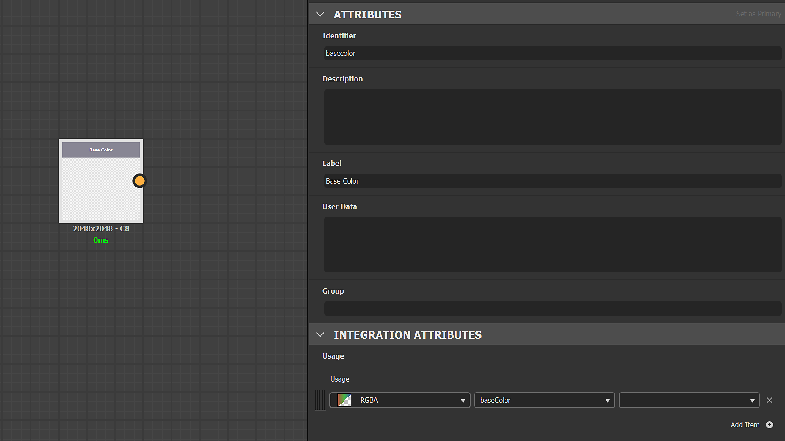

# 创建和编辑自定义预设

可以使用Substance 3D Designer创建自定义预设。

创建自定义预设遵循的规则与为Sampler创建自定义筛选器的规则相同。 可在[此处](../../filters/custom-filters.md)获取文档。

## 创建

## 创建图形

打开Substance Designer并创建新的Substance图形。

打开图形属性并填写以下必填信息：

* 标签：输入将在Sampler界面中使用的自定义预设的名称
* 用户数据： <b>alchemist：：type=filter</b>

## 输入和输出的定义

### 输入

输入表示导出前要变换的材料渠道。

为每个材料通道创建一个“输入颜色”节点（或灰度），并在每个输入节点的属性中添加<b>用法</b>，以确保在您的材料和自定义预设之间建立连接。

示例：Base color输入的定义

{width="600px"}

### 输出

输出表示纹理导出的结果。

为每个纹理创建一个输出节点，并在每个输出节点的属性中添加<b>usage</b>和<b>label</b>。 <b>标签</b>将显示在导出器窗口的“频道”列表中以及您的纹理文件的名称中。

示例：自定义纹理颜色不透明度的定义

{width="600px"}

#### 声道打包和声道转换示例

在一个纹理中打包3个灰度通道：

{width="600px"}

从PBR金属/粗糙度到PBRSpecular/光泽度的通道转换：

{width="600px"}

## Import

要导入新预设，请执行以下操作：

1. 单击<b>预设下拉列表</b>右侧的<b>管理预设</b>按钮。
1. 使用<b>预设列表</b>底部的<b>导入预设</b>按钮。

{width="400px"}
