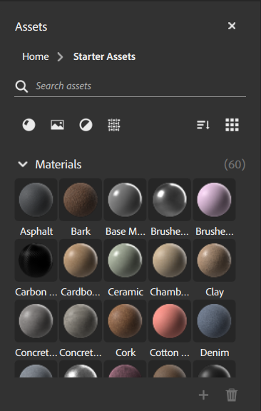

# “资产”面板

**资源面板**&#x200B;包含可用于构建创意的资源。 Sampler提供了一组材料、滤镜和纹理生成器，可帮助您快速入门。

**资源面板**&#x200B;包含一些控件，可帮助组织和查找资源：

* 使用搜索栏可快速查找资源。
* 按类型筛选资源。
* 按类型或类别对资源进行分组。
* 在列表视图和图标视图之间切换。

## 将资源添加到“资源”面板

要将您自己的资源添加到资源面板，请单击&#x200B;**资源面板**&#x200B;右下角的&#x200B;**+**。 浏览到资源的位置，选择它，然后单击&#x200B;**打开**。 您可以通过将自定义资源拖到垃圾桶上，将其从&#x200B;**资源面板**&#x200B;中删除。

## 激活其他渠道

将材料从资源面板拖放到图层堆叠时，可能会向您提供激活额外渠道的机会。 当材料输出当前未在您的资源中激活的频道时，会提供此选项。 如果您想从材料的全部复杂性中获益，如某些各向异性效果或涂层，则您可能需要激活它。

>[!NOTE]
>
> 在&#x200B;**“资源”面板**&#x200B;中只能删除自定义资源。 无法删除Sampler的默认资源。
