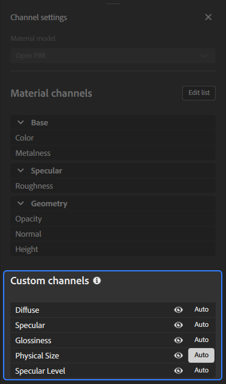

# “通道设置”面板

<table>
<tr style="border: 0;">
<td style="border: 0; width: 30%" valign="top">

**通道设置**&#x200B;面板控制为当前素材计算的通道列表。 您可以管理频道可见性、从素材中添加或移除频道，或者更改正在使用的材质模型。

</td>
<td style="border: 0;" valign="top">

</td>
</tr>
</table>

## 材质模型

使用此下拉列表选择用于渲染素材的着色器框架。 **声道设置面板**&#x200B;中的选项将根据所选材质模型而更改。

更改材质模型时，需要为新模型重新计算图层栈栈，并提供不同的通道。 Sampler会尝试最大限度地减少转换过程中的数据丢失；但是，此更改可能会导致新材质模型的外观出现细微差异。

>[!NOTE]
>
> 可以从Adobe标准素材(ASM)更改为OpenPBR，但当前无法从OpenPBR更改为ASM。

## 材质通道

<table>
<tr style="border: 0;">
<td style="border: 0; width: 30%" valign="top">

此部分显示默认情况下基于工作流程计算的通道的列表。

您可以使用&#x200B;**编辑列表按钮**&#x200B;打开&#x200B;**通道选择**，并更改为您的素材计算的通道。

</td>
<td style="border: 0;" valign="top">

{width="200px"}

</td>
</tr>
</table>

>[!NOTE]
>
> 例如，Substance Source中的某些素材不会输出不透明度或环境遮蔽通道。 即使不透明度通道被标记为“已计算”，如果Substance文件不输出，Sampler也不会生成它。

### 通道选择

“通道选择”窗口可让您在素材中添加或删除通道。

若要将频道添加到您的素材，请选择一个可用频道并使用&#x200B;**>按钮**。
要从您的素材中删除频道，请从&#x200B;**所选频道列表**&#x200B;中选择该频道，然后使用&#x200B;**&lt;按钮**。
您可以使用&#x200B;**≫按钮**&#x200B;将所有可用频道添加到您的素材，或使用&#x200B;**≪按钮**&#x200B;从您的素材中删除所有频道。

您还可以使用预设来快速为素材选择通道列表。 默认情况下，Sampler包含许多预设，但您也可以创建自己的预设：

1. 将所需通道添加到您的素材中。
1. 使用&#x200B;**另存为预设按钮**。
1. 为预设命名。

>[!NOTE]
>
>保存预设不会将预设应用于您的素材。

## 自定义通道

切换默认情况下未包含在选定工作流程中的其他通道。

<table>
<tr style="border: 0;">
<td style="border: 0; width: 30%" valign="top">

每个自定义通道都有两个可用于控制它的选项：

1. 使用“可见性”切换开关可在2D视图中显示或隐藏通道。
2. 使用&#x200B;**自动按钮**&#x200B;切换是否自动计算通道。
   * 打开后，如果栈栈中位于通道上方的图层请求该通道，则会计算该通道。
   * 关闭时，始终计算通道。

</td>
<td style="border: 0;" valign="top">

{width="200px"}

</td>
</tr>
</table>

