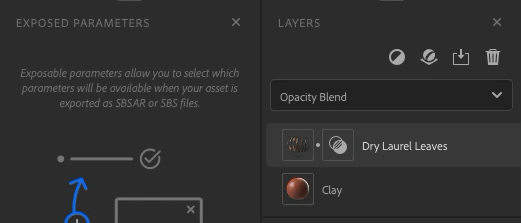

# 公开参数面板

**公开参数面板**&#x200B;包含从&#x200B;**属性面板**&#x200B;公开的参数。

彩色点有助于直观地看到参数连接到哪个图层。 空点表示参数来自混合图层。

有几种方式可与公开参数交互：

| 操作 | 操作方法 |
| --- | --- |
| 取消公开参数 | 右键单击参数并选择“取消公开”。 |
| 编辑参数的标签 | 右键单击参数并选择“编辑”，输入新标签。 |

您可以正常使用&#x200B;**“属性”面板**&#x200B;与所有参数交互。 更改将反映在3D视口中。
