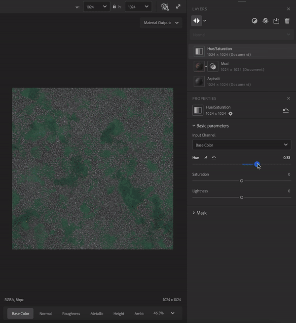

# “图层”面板

<table>
<tr style="border: 0;">
<td style="border: 0; width: 70%" valign="top">

**图层面板**&#x200B;包含用于管理图层的图层栈栈和快捷键。 **图层面板**&#x200B;与&#x200B;**属性面板**&#x200B;紧密协作 — 从&#x200B;**图层面板**&#x200B;中选择一个图层，以在&#x200B;**属性面板**&#x200B;中查看其属性。

**图层面板**&#x200B;包含三个主要部分：

1. “工具”部分包含可用于以下操作的按钮
   1. 显示/隐藏图层分辨率
   1. 切换图层解析策略
   1. 添加图层
   1. 添加基础材质
   1. 导入自定义滤镜
   1. 移除图层
1. **混合模式选择器**&#x200B;允许您调整图层与其下方图层的混合方式。 **混合模式选择器**&#x200B;仅在选择素材图层时可用 — 滤镜不使用混合模式。
1. **图层栈栈**&#x200B;包含组成您的资源的所有图层。

</td>
<td style="border: 0;" valign="top">

</td>
</tr>
</table>

## 图层栈栈

图层栈栈是构成您当前素材的素材、滤镜和其他资源的集合。 与在Photoshop和Substance 3D Painter中一样，图层栈叠从底部图层开始工作到顶部图层结束。 这意味着每个图层都可以影响它下面的图层。

有几种方法可以管理图层栈栈：

| 操作 | 操作方法 |
| --- | --- |
| 添加图层 | 将资源从&#x200B;**资源面板**&#x200B;拖到视口以将其添加到图层栈叠的顶部。 将资源从&#x200B;**资源面板**&#x200B;拖到图层栈叠中，以将其添加到图层栈叠中的特定位置。 使用“工具”部分中的&#x200B;**“添加图层”**&#x200B;按钮从列表中选择滤镜。 |
| 移动图层 | 在图层栈栈中拖动图层以移动它。 移动图层时，将出现一条条，指示图层将放置的位置。 |
| 删除图层 | 单击图层以将其选中，然后按&#x200B;**Del**&#x200B;或使用“工具”部分中的&#x200B;**移除图层**&#x200B;按钮。 |
| 切换可见性 | 将鼠标悬停在图层上以查看图层右侧的&#x200B;**可见性切换**。 关闭图层的可见性后，将不计算该可见性。 |
| 查看图层属性 | 单击图层以在&#x200B;**“属性”面板**&#x200B;中打开查看其属性。 |
| 显示/隐藏分辨率 | 单击&#x200B;**“图层”面板**&#x200B;左上角的按钮。 |
| 切换所有图层分辨率 | 单击“显示/隐藏分辨率”按钮旁边的箭头，选择适用于栈栈中所有图层的策略。 |
| 切换图层分辨率 | 单击图层以打开其属性，单击&#x200B;**“属性”面板**&#x200B;上的分辨率，选择图层将使用的分辨率策略。 |

## 图层类型

有三种类型的图层：

* 材质
* 滤镜
* 图像

### 素材图层

素材图层包含多个通道中的信息，并且可以与其下面的图层混合。 素材图层会根据它们是否位于栈叠底部而略有不同。 例如，下图显示了一个岩石素材拖入图层栈叠两次 — 请注意，底部图层没有图标可用于控制混合，而顶部图层用于控制混合。

材料层的一般规则为：

* 素材图层始终使用文档分辨率。
* 栈栈底部的素材图层没有任何可混合的内容，因此&#x200B;**混合模式选择器**&#x200B;不可用。
* 不在栈栈底部的素材图层可以与它下面的图层混合，因此您可以使用&#x200B;**混合模式选择器**&#x200B;更改混合模式。 此外，**图层图标**&#x200B;旁边会显示&#x200B;**混合图标**。 选择&#x200B;**混合图标**&#x200B;以根据已选择的混合模式调整图层的混合设置。

### 筛选图层

滤镜对其下方的图层执行操作以创建特定效果。 例如，在&#x200B;**色相/饱和度滤镜**&#x200B;上方的图像中，允许您调整下方图层的色相、饱和度和亮度。

某些滤镜可以将一个或多个其他图层作为输入。 例如：

* **Atlas Scatter筛选器**&#x200B;可以将素材作为输入。
* **Atlas Scatter筛选器**&#x200B;将根据&#x200B;**实例**&#x200B;参数从输入贴图集素材中散点Atlas Scatter。

将材质拖到图层输入插槽上以将其用作输入。

滤镜图层将使用首选项中设置的默认分辨率策略。 您可以在“properties”（属性）面板中更改滤镜的分辨率。

### 图像图层

图像图层使用其自己的分辨率，主要在“图像到材质”工作流程中。 与素材图层一样，您可以通过从&#x200B;**资源面板**&#x200B;拖动图像来创建图像图层。

您可以将图像从系统的文件浏览器拖到Sampler中，如果图层栈栈中已有图层，则图像图层将添加到栈栈顶部。 如果图层栈栈中没有图层，将显示一个对话框，您可以在其中选择如何处理图像：

* **图像到材质**&#x200B;允许您使用AI将图像转换为材质。
* **多角度转材质**&#x200B;允许您使用多个具有不同光照条件的图像来创建材质。
* **纹理导入**&#x200B;允许您使用导入的图像作为纹理通道来构建材质。
* **用作位图**&#x200B;将图像导入为简单的位图图层。

您还可以一次将多个选定图像拖入图层栈栈，将它们全部作为单个图层导入。 这有助于多图像滤镜，例如&#x200B;**HDR合并**&#x200B;和&#x200B;**多角度转材质**。 选择包含多个图像的图层，以更改每个图像的通道数据。
