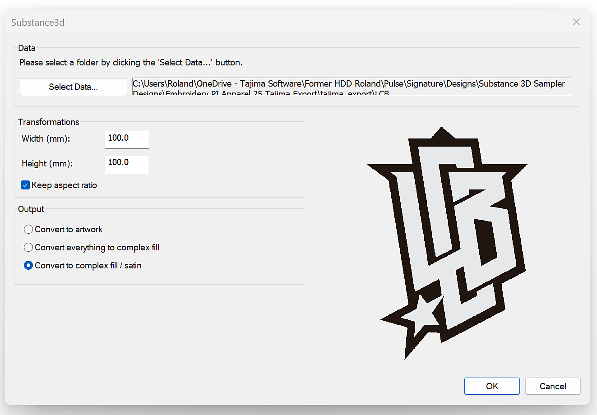

# 刺绣文件的Tajima导出器增效工具

通过此首次概念验证，您现在可以将其数字刺绣设计从Adobe的Substance 3D直接转移到<b>Tajima DG17</b>刺绣软件 — 无需费时的手动数字化。

让我们逐步了解如何使用它。

## 下载

在此处下载Sampler Tajima增效工具：

[在此处下载插件](https://www.adobe.com/go/sampler-tajima-plugin)

## 安装

*从Sampler UI：*

转到首选项>增效工具和脚本>添加增效工具

选择下载内容的解压缩文件夹

*从您的文件资源管理器：*

转到“文档”>“Adobe”>“Adobe Substance 3D Sampler”>“插件”

在此处复制/粘贴下载内容的解压缩文件夹

## 安装

打开包含刺绣素材的Sampler（5.0.3或更高版本）项目。

打开Tajima增效工具并导出到您选择的位置

<b>Tajima软件</b>

<b>1</b> — 启动Substance 3D向导

<b>2</b> — 选择适当的<b>数据文件夹</b>（Sampler导出文件夹）

<b>3</b> — 选择刺绣线程图表

<b>4</b> — 应用样式预设以获得最佳结构设置

<b>5</b> — 根据需要编辑形状以获得最佳结果

<b>6</b> — 预览设计工作表，使用可机器扫描的条形码

