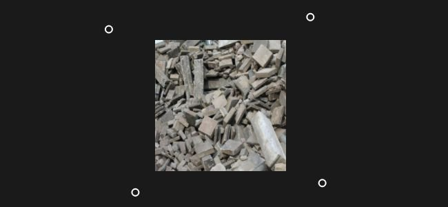

# 版本2020.2 (2.2)

**Substance Alchemist2020.2“Udon”**&#x200B;引入了一个新的AI支持图像材料流程，以便将单个图像输入变换为完整的PBR材料；改进了“材料创建模板”；对工作流程和可用性进行了大量改进；还推出了新内容（如新滤镜）。

发行日期：*2020年6月15日*

## 主要功能

### 图像到材料（AI支持）

**图像到材料**&#x200B;模板有一个名为&#x200B;**AI Powered**&#x200B;的新设置。 这一新设置为从单个输入图像生成高质量的PBR材料提供了更好的结果。

AI驱动设置使用机器学习来识别形状和对象，并准确生成Height和正常信息。 此设置还包括用于移除任何阴影和高光的“高光”滤镜。 新设置最适合室外材料，因为算法是使用地面、鹅卵石、树皮、石头和其他在自然光照下照明的基于外部的表面进行训练的。 进一步的更新将为支持的材料带来更大的灵活性和多功能性。 有关更多详细信息，请参阅[专用文档页面](../../filters/tools/image-to-material.md)。

下面是两种算法生成的Height信息与其默认值的比较：

{width="800px"}

>[!NOTE]
>
> AI驱动设置需要特定硬件。 它仅在使用Nvidia GPU的Windows和Linux上可用。 有关详细信息，请参阅[技术要求](../../getting-started/system-requirements.md)。

### 新的纹理导入模板

图像导入弹出窗口在几个方面进行了改进。 还有一种名为&#x200B;**纹理导入**&#x200B;的新进程类型。

* **改进了接口**\
  界面已更新，更易于使用和学习，并详细说明了每个可用选项。
* **新的纹理导入选项**\
  现在有一个名为&#x200B;**纹理导入**&#x200B;的新选项，允许导入一组图像，并根据其名称直接连接到正确的输出通道。 它提供了一种从现有图像组设置材料的简单方法。 有关详细信息，请参阅[专用文档页面](../../features-and-workflows/texture-import.md)。

### 针对滤镜蒙版输入的新的2D绘画

在此版本中，现在可以直接在2D 视图中绘画和编辑滤镜蒙版，而无需导入外部图像。 该画将自动拼贴，以便创建无缝材料。

{width="450px"}

* **正在进入2D绘画模式**\
  要启动2D绘画模式，只需单击“滤镜”属性中蒙版名称旁边的画笔图标。

  
* **2D绘画工具栏**\
  在绘画模式下，2D 视图将在顶部显示一个新工具栏，并具有以下功能：

  * **画笔颜色**：调整用于绘制蒙版的画笔灰度值。
  * **画笔笔大小**：调整画笔大小以绘制蒙版。
  * **重置蒙版**：将当前蒙版清除为黑色，任何绘画信息都将丢失。
  * **停止绘制**：退出2D绘画模式。

  
* **键盘快捷键**\
  绘画模式支持以下快捷键来加快绘画过程：

  * **X**：反转画笔的当前灰度值。
  * **Ctrl +鼠标滚轮**：更改画笔大小。
  * **[或]**：更改画笔大小。

### 新的地图集和贴花创建模式快捷键

添加了两种新的创建模式，以利用新型的材料并简化其在图层堆叠中的设置：

* **贴花模式**\
  **Alt +拖放**：从集合中拖放材料时，按住并保持&#x200B;**Alt**&#x200B;可自动在贴花投影模式下创建材料。
* **Atlas模式**\
  **Shift +拖放**：从集合中拖放材料时，按住Shift键以自动在Atlas Scatter模式下创建材料。

### 新的透视校正工具

已向滤镜列表添加名为&#x200B;**透视校正**&#x200B;的新工具，允许调整或补偿图像透视。

* **透视校正**\
  使用此滤镜，可以修复扫描和摄影图像中的默认设置，以使其更适合材料创建。 此滤镜提供了四个控制点，它们表示图像的初始角。 移动点以调整/补偿透视。

  

### 改进的颜色构件

现在，“参数”面板中可见的颜色构件提供更多控件：

* **颜色值工具提示**\
  将鼠标悬停在颜色构件上时，现在会出现工具提示，描述当前的颜色值（十六进制格式）。
* **右键单击操作**\
  右键单击颜色构件时，将显示包含以下操作的新上下文菜单：
  * **清除**：将颜色设置为黑色，将Alpha值设置为零。
  * **复制**：将小部件的当前颜色值复制到内存中。
  * **粘贴**：将内存中的当前颜色值粘贴到构件中。

### 新内容

此版本带来了许多新的和多样化的内容：

* **新的默认网格**\
  有三个新网格可用于展示视口中的材料：
  * 鞋形
  * 男式T恤
  * 女式T恤
* **新筛选器**\
  此版本中提供了5个新过滤器：
  * 裂缝
  * 苔藓
  * 面组缝合
  * 地板拼贴
  * PBR 验证
* **新混合模式**
* 滤镜和其他工具现在支持名为&#x200B;**每通道混合模式**&#x200B;的新混合模式。 启用此模式后，可以调整“属性”面板中每个通道的混合操作。
* **导出预设**\
  此版本包括新的和更新的导出预设：
  * VStitcher
  * CLO
  * Unity HDRP模板中的DetailMap支持
