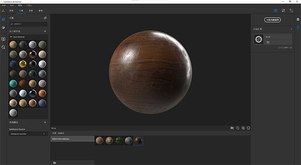

# 版本2020.3 (2.3)

**Substance Alchemist2020.3“粉丝”**&#x200B;引入了新内容和新的工作流程，例如从单个图像创建地图集。 我们还改进了材料的缩略图质量，并将界面本地化为中文。

发行日期：*2020年10月26日*

## 主要功能

### 图像到材料（AI支持）

* 新参数
  * 通过调整不同级别的细节（微、中和大），优化您的几何形状（正常和Height通道）
  * 调整愉悦强度以在base color中保留一些信息
  * 变量和柔和度参数可用于生成更准确的粗糙度通道
* 支持Nvidia RTX 3000系列

### Atlas创建工作流

通过添加两个新滤镜，简化了Substance Alchemist中从单个图像创建的贴图集。

Atlas生成器：滤镜自动从base color生成不透明度通道。 也会在base color上创建颜色漫射。 建议使用背景均匀的图像。

Atlas Splitter：此滤镜允许您隔离贴图集的特定元素并重新调整其大小。

### 缩略图

现在，使用新环境图Studio\_06的Substance DesignerPBR 渲染生成缩略图。

如果缩略图嵌入在Substance存档文件(\*.sbsar)中，Substance Alchemist现在将读取缩略图，而不会重新生成缩略图。

首选项中的新参数可用于更改缩览图质量以节省时间。 默认情况下，品质设置为“高”。

### 中文本地化

Substance Alchemist现已本地化为中文。 您可以在“首选项”中更改界面语言。

### 新内容和更新的内容

* **技术筛选器**

变形：变形材料以打破图案或使材料更鲜艳。

表面浮雕：在材料上添加浮雕和变化（替换Height调制滤镜）

反转：反转您选择的通道

* **筛选器风化**

Scratches：在材料上添加划痕。 适用于木材和金属等。

指纹：在金属或闪亮的材料上添加指纹。

丢弃的牙膜：在地面上散点旧牙膜

* **颜色筛选器**

着色：色调部分或全部材料

颜色变化：现在可让您选择如何划分材料。 除了base color之外，您还可以使用Height、ambient occlusion、金属和粗糙度。

替换颜色：在2D 视图上选取一种颜色，然后选择一种新颜色。
