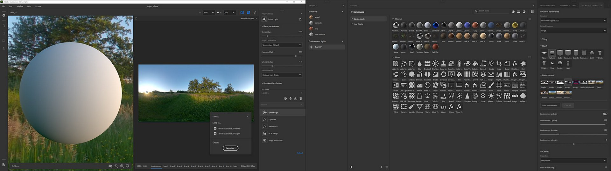
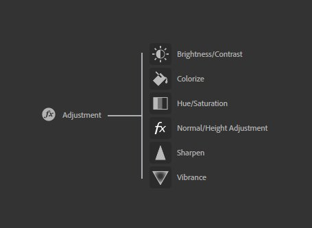

# 版本3.0

**Substance 3D Sampler 3.0.0**&#x200B;已连接到Adobe Creative Cloud，因此是Substance Alchemist的新名称。 它提供了完整的UI重工、对创建环境光的支持、经过全面重工和新建的过滤器、“发送到”功能和ASM着色器支持。

发行日期：*2021年6月23日*

## 主要功能

### 全新界面和面板管理

有了新名称，就有了新的外观。 Sampler的UI经过彻底改进，可进行更多自定义且更轻松的访问。

{width="600px"}

面板可以停放和取消停放，让您充分利用双屏幕设置。

### 新建项目工作流

Sampler现在处理项目。 使用[项目面板](../../interface/panels/project-panel.md)可以按项目管理和分组资源。 项目存储在Sampler文件Substance中，可轻松共享。

### 新建资源面板

[资源面板](../../interface/panels/assets-panel.md)是“资源”面板的一种新的常用设计，与您的收藏集结合使用。

* 3个部分：入门资源+您的资源+已连接的本地文件夹
* 新的资源类型支持：滤镜和图像
* 窄视图/宽视图
* 筛选和搜索筛选器

### 新环境光创作

{width="600px"}

Sampler现在让您不仅仅制作材料。 环境光是具有[自己的筛选器集](../../filters/hdri-tools/hdri-tools.md)的一种新型资源。 从[包围的360张照片](../../filters/hdri-tools/hdr-merge.md)开始，从头[构建环境光](../../filters/hdri-tools/shape-light.md)，或[编辑现有的HDR文件](../../filters/hdri-tools/nadir-patch.md)。

### 重新设计和新滤镜

{width="600px"}

所有现有的过滤器都已重新设计：

* 支持规格/光泽通道。
* 支持自定义蒙版
* 标准化参数名称
* 几乎每个滤镜的图标

调整滤镜已根据功能拆分为单独的滤镜，以模拟Photoshop：

添加了一些新过滤器：

* [变形变换](../../filters/tools/warp-transform.md)
* [织造](../../filters/generators/weave.md)
* [面板](../../filters/generators/panel.md)

### 新的“发送到”功能

Sampler现在可以[只需单击一下，即可轻松使用Substance 3D Painter和Stager共享材料和光照环境](../../interface/panels/share-panel.md)。

### 新实时渲染引擎

* 支持ASM材料，在具有较多材料通道的应用程序之间实现一致的外观。
* 在2 [实时引擎](https://helpx.adobe.com/cn/substance-3d/unlisted/documentation/sadoc/viewer-settings-188973164.html)之间切换
* 能够控制网格上的默认纹理

### 一般改进

* 新语言
* 应用程序响应能力
* 非方形纹理支持
* 工具撤消/重做
* 为图像导入图层中的图像分配自定义用途
* 重置参数值
* 在Windows任务栏中导出进度

## 教程

以下是我们的视频教程，其中介绍了新增功能：

## 发行说明

### 3.0.0华夫饼

*（2021年6月23日发布）*

**已添加：**

* [品牌推广]Substance Alchemist成为Adobe Substance 3D Sampler
* [品牌推广]新应用程序图标
* [UI]新的用户体验和用户界面
* [UI]新的花屏
* [UI]面板在界面中不可停靠和可停靠
* [UI]在同一列中最多停放3个面板
* [UI]在同一面板中最多停靠3个面板（选项卡）
* [UI]取消停靠面板可在同一屏幕或不同屏幕中创建单独的窗口
* [UI]单击已关闭面板的图标时，会弹出这些面板
* [UI]通过移动面板图标来重新排列左右栏
* [UI]新工具栏可直接访问特定的滤镜（裁切、变换、透视变换、仿制图章）
* [UI]左侧栏中新增了“获取内容”按钮
* [UI]使用“获取内容”按钮直接将文件导入到您的资源中
* [UI]使用“获取内容”按钮将文件直接导入到您的图层
* [UI]使用“获取Substance 3D Assets”按钮直接访问Adobe内容网站
* [UI]现在，可直接在视口中访问分辨率构件
* [UI]所有UI元素现在都是动态加载的
* [UI]快捷键 — 使用“2”可切换2D 视图的可见性
* [UI]快捷键 — 使用“3”可切换3D视图的可见性
* [欢迎屏幕]使用“新建”按钮单击即可创建项目
* [欢迎屏幕]新增图稿横幅
* [Project]所有项目现在都与一个唯一的文件相关联
* [Project]新建项目文件扩展名.ssa
* [项目]另存为项目将要求您选择保存项目的位置
* [Project]如果未保存项目，关闭Sampler将要求您保存项目
* [Project]如果自上次保存后进行了修改，关闭Sampler将会要求您保存项目
* [项目]项目名称显示在视口上方
* [Project]如果项目名称未保存或包含自上次保存以来所做的修改，则项目名称将以斜体显示星号
* [项目]直接从您的操作系统资源管理器打开.ssa项目文件
* [Project]从您的操作系统资源管理器中打开.sbsar将启动Sampler，同时显示准备好使用的此。sbsar 文件的新项目
* [项目]从您的操作系统资源管理器中打开.alch（旧版Substance Alchemist文件）
* [项目面板]包含在一个项目中创建的所有资源的新面板
* [项目面板]使用+图标创建资源（材料或环境光）
* [项目面板]右键单击资源可打开上下文菜单
* [项目面板]从右键单击上下文菜单中，可以删除资源
* [项目面板]在右键单击上下文菜单中，您可以复制资源
* [项目面板]在右键单击上下文菜单中，可以重命名资源
* [项目面板]在资源之间切换不会丢失修改
* [分辨率]您现在可以为所有资源设置非方形分辨率
* [解决方案]解决方案值通过项目中的资源保存
* [环境光]在Substance 3D Sampler中创建环境光
* [环境光]创建环境光时，拖放图像将显示“环境光创建模板”窗口
* [环境光]在“环境光创建模板”中，选择“环境导入” ，以将图像在3D视图中分配给环境
* [环境光]在环境光创建模板中，选择HDR合并以从多个具有不同曝光度的360度图像创建环境光
* [环境光]在“环境光创建模板”中，选择“用作位图”以在创建环境光之前编辑图像
* [环境光]在“图像导入”图层指定环境使用情况，以便直接在3D视图中将该图像分配给环境
* [环境光]在环境通道的2D 视图中，有一个自动颜色校正使渲染的显示与3D视图中的显示相同
* [环境光]用于创建环境光的新专用内容
* [资源面板]“资源”和“过滤器”面板合并到一个新的“资源”面板中
* [资源面板]“资源”面板现在支持以下资源类型：材料、滤镜和图像
* [资源面板]所有入门资源都可在“入门资源”部分中访问
* [资源面板]“入门资源”部分为只读
* [资源面板]新增“您的资源”部分
* [资源面板] “您的资源”部分是您可以导入所有资源的地方
* [资源面板]“您的资源”中的所有资源都添加到文档中的特定文件夹中
* [资源面板]连接“资源”面板中的本地文件夹以添加新部分
* [资源面板]搜索将在当前文件夹及其子文件夹中搜索
* [资源面板]在具有痕迹的文件夹和子文件夹之间导航
* [资源面板]按材料、筛选器或图像筛选当前文件夹
* [资源面板]组合多个滤镜以仅获取素材和图像
* [资源面板]通过在网格或列表之间切换来更改显示
* [资源面板]滤镜使用其图标表示
* [资源面板]图像使用其预览呈现
* [资源面板]增加宽度将更改用于导航文件夹的特定视图的面板布局
* [资源面板]在非只读部分上，通过将资源拖放到素材箱图标来删除资源
* [资源面板]右键单击资源可打开上下文菜单
* [资源面板]从右键单击上下文菜单访问资源元数据（名称、类别、位置）
* [资源面板]从右键单击上下文菜单中，删除资源（仅适用于非只读部分）
* [资源面板]从右键单击上下文菜单中，浏览Adobe Bridge中的资源
* [图层面板]用于直接在图层上添加基础材质的新图标
* [图层面板]快捷键- Shift + B将在您的图层上添加一个基础材质
* [图层面板]图层现在具有缩略图预览（材料缩略图、滤镜图标或图像预览）
* [属性面板] “属性”面板标题的新设计，带有资源名称和资源缩略图
* [属性面板]滤镜图层现在支持预设
* [属性面板]在图像导入图层上，右键单击图像预览以在Photoshop中编辑图像
* [Adobe Bridge]在Adobe Bridge中浏览您的资源，将在资源位置启动Bridge
* [Adobe Photoshop]在Adobe Photoshop中编辑将可在Photoshop中打开准备编辑的图像
* [Adobe Photoshop]在Adobe Photoshop中每次保存时，编辑的图像都会在Sampler中重新加载
* [Substance 3D Designer]从Adobe Substance 3D Designer发送的资源将直接出现在“资源”面板的“您的资源”部分
* [导出]将资源直接发送到Adobe Substance 3D Painter和Adobe Substance 3D Stager
* [导出]将材料和环境光发送到Adobe Substance 3D Painter
* [导出]将环境光发送到Adobe Substance 3D Stager
* [Rendering]现在支持新的材料属性，并以3D形式渲染
* [渲染]添加光泽支持（光泽颜色、光泽不透明度和光泽粗糙度）
* [渲染]添加涂层支持（Coat color、Coat roughness、Coat normal、Coat specular level和涂层IOR）
* [渲染]添加各向异性支持（Anisotropy level和Anisotropy angle）
* [渲染]添加Specular edge color支持
* [渲染]在“通道设置”面板中激活这些新属性
* [渲染]在Beta版中引入了新的实时引擎(2021)渲染器
* [渲染]在“查看器设置”面板中的两个渲染器版本之间切换
* [渲染]实时引擎(2021)渲染器支持translucency、吸收和散射材料属性
* [渲染]实时引擎(2021)渲染器引入了从环境光计算阴影的新方法
* [渲染]实时引擎(2021)渲染器实时计算环境光的辐照度
* [着色器设置面板]用于调整特定着色器着色器参数的新材料设置面板
* [着色器设置面板]新参数（“正常比例”、“Height比例”、“Height度”、“发射强度”、“IOR”、“Coat normal强度”和“涂层IOR”）
* [着色器设置面板]实时引擎2021的特定参数（次表面散射、散射距离、红移和瑞利散射）
* [着色器设置面板]设置值按资源存储
* [查看器设置面板]添加了默认环境光照的预览
* [查看器设置面板]添加了默认网格的预览
* [查看器设置面板]新的环境不透明度参数
* [查看器设置面板]新的环境模糊参数（特定于实时引擎2021渲染器）
* [本地化]德语和法语的新翻译
* [Content]新的默认入门材料
* [Content]新的默认环境光
* [内容]所有过滤器均已更新、清除和优化
* [内容]调整滤镜已拆分为多个滤镜
* [内容]全新亮度/对比度滤镜
* [内容]新色相/饱和度滤镜
* [内容]新的自然饱和度滤镜
* [内容]新的锐化滤镜
* [内容]新常规/Height调整
* [内容]新的面板过滤器
* [内容]全新涂抹滤镜
* [内容]新的Weaves滤镜
* [内容]新的变形变换滤镜
* [内容] AO过滤器的新Height
* [Content]新Height为普通滤镜
* [内容]颜色替换 — 在新的受支持通道（光泽、涂层、各向异性等）中进行替换
* [内容]颜色变化 — 手动模式可精确选择要更改的颜色
* [Content]拼贴 — 用于可视化接缝剪切的选项
* [Content]拼贴 — 用于绘画接缝剪切以得到完美拼贴的选项
* [Content] Match — 用于添加材料以匹配其颜色和粗糙度的选项
* [内容]匹配 — 现在可以在图像上使用此功能来匹配其他图像的颜色
* [内容]环境光 — 新的色温滤镜
* [内容]环境光 — 新的曝光度滤镜
* [内容]环境光 — 新的曝光度预览滤镜
* [Content]环境光照 — 新Nadir Patch滤镜
* [Content]环境光照 — 新Nadir Extract滤镜
* [内容]环境光照 — 新光线滤镜（球体、直线、形状、平面）
* [内容]环境光 — 新全景修补滤镜
* [内容]环境光照 — 全新拉直水平滤镜
* [Content]环境光照 — 新的HDR合并滤镜

**已知问题：**

* [实时引擎2021]更改布局，崩溃应用程序
* [实时引擎2021]繁重的计算，崩溃应用程序
* [面板] MacOS — 未停靠的面板位于所有应用程序之前
* [构件]变换和位置构件可能会消失。 隐藏和取消隐藏图层以使其显示。
* [导出]导出环境光的SBSAR时会失去32位深度精度
* [资源面板]打开文件夹时，资源可以突出显示
* [属性面板]重置参数不会重置组合框UI
* [本地化]更改语言不会影响项目面板，直到重新创建该面板
