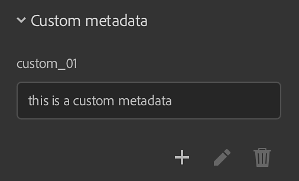

# 版本3.2

**Substance 3D Sampler 3.2**&#x200B;引入了端到端材料数字化工作流程，可以捕获和处理材料物理尺寸、布料编织和通道切换等新滤镜以及创建自定义元数据的功能。

发行日期： 25 *2022年1月*

## 主要功能

### 实际大小

此版本中引入了新的材料扫描工作流程，用于捕获和处理材料物理尺寸。

匹配数字环境中采样/图像的实际[物理尺寸](../../features-and-workflows/end-to-end-physical-size-workflow.md)，以便在任何软件中创建物理上准确的材料。

{width="400px"}

### 布料编织

此版本中添加了全新的生成器。 通过布料织造，可创建和设计具有定制织造图案的布料。

<table>
<tr style="border: 0;">
<td style="border: 0;" valign="top">

{width="390px"}

</td>
<td style="border: 0;" valign="top">

{width="400px"}

</td>
</tr>
</table>

### 自定义元数据

将自定义元数据添加到材料。 所有自定义元数据都将包含在材料文件(SBSAR)中，以确保跨应用程序共享数字材料的工作流程更加高效。

{width="264px"}

### 通道交换机

使用声道切换，您现在可以切换材料输出映射的声道。

{width="300px"}

### 导出

此版本中添加了新的导出功能。

* 设置。sbsar 文件压缩设置

  {width="400px"}
* 导出.sbs(ar)文件时设置图形类型
* 保持EXR、JPEG、PNG、TARGA、TIFF的物理比例

  {width="400px"}

## 发行说明

### 3.2.0八角德

*（2022年1月25日发布）*

**已添加：**

* [物理尺寸]新建“物理尺寸”面板
* [物理尺寸]将物理尺寸选项添加到“材料创建模板”窗口
* [物理尺寸]添加物理尺寸测量工具
* [物理尺寸]添加物理尺寸自动测量工具
* [物理尺寸]添加物理尺寸诊断工具
* [物理尺寸]允许设置物理尺寸的z值
* [物理尺寸]用于设置2D 视图缩放级别的下拉构件
* [物理尺寸]缩放级别下拉列表中新增了“物理比例显示”选项
* [物理尺寸]缩放级别下拉列表中新增了“适合物理尺寸”选项
* [物理尺寸]在2D 视图中显示物理尺寸
* [物理尺寸]以3D视口显示物理尺寸
* [物理尺寸]在图像导入对话框中，如果存在导入的物理尺寸，则显示高度图深度
* [物理尺寸]在资源上下文菜单中显示物理尺寸
* [物理尺寸]在首选项中设置长度单位
* [物理尺寸]按实际比例出口纹理
* [元数据]能够将自定义元数据添加到用户创作的资源
* [导出]将自定义元数据导出到.sbs(ar)文件
* [导出]将描述、类别、作者和标记元数据导出到.sbs(ar)文件
* [导出]将物理尺寸导出为.sbs(ar)文件
* [导出]设置。sbsar 文件压缩设置
* [导出]将资源缩览图导出为.sbs(ar)文件
* [导出]导出.sbs(ar)文件时设置图形类型
* [应用程序]实时引擎2021不再可用
* [应用程序]撤消/重做现在支持拼贴(U，V)和Height缩放滑块更改
* [渲染]保存所创作的资源时生成磁盘缓存
* [资源]按住Ctrl键并单击，可在“资源”面板中启用多个资源类型过滤器
* [UI]能够锁定拼贴(U，V)滑块
* [UI]在文本字段中添加具有“复制”、“剪切”、“粘贴”、“全部复制”和“全部剪切”的上下文菜单
* [UI]长度单位（米、英寸、秒差距、...） 标签和文本字段中的支持
* [UI]用户可以设置用于显示数字的小数精度
* [UI]在所有相关的度量弹出窗口中使用单位
* [本地化]默认新资源名称现已本地化
* [内容]新型布料织造机
* [内容]新的通道切换过滤器
* [Content]所有相关滤镜现在都已知道该物理尺寸
* [内容]用于木质光泽的新图标
* [内容]所有滤镜现在都与Adobe Standard Material(ASM)通道兼容
* [内容]滤镜现在可以有“环境”变体

**已修复：**

* [2D 视图]移除后，频道将保留在列表中
* [Application]无法复制从操作系统文件资源管理器加载的资源
* [应用程序]退出时崩溃
* [应用程序]有时在“资源”面板中单击“入门资源”时会崩溃
* [应用程序]删除材料时出现崩溃
* [应用程序]环境变量“SUBSTANCE\_DISABLE\_SPECIFIC\_FEATURES”在设置为“0”或“”时仍处于活动状态。
* [应用程序]保存包含多个材料的项目时冻结
* [应用程序]导入图像可能会导致崩溃
* [应用程序]首次启动时缺少某些入门资源
* [导出]导出资源有时会导致崩溃
* [图层]当图层面板关闭或不可见时，无法导入图像
* [图层]更改语言会导致重新计算当前资源
* [图层]更改导入图像的用法不会更新要使用的滤镜变化
* [图层]微调位于图像到材料图层(AI)下方的图层时，有时不会计算该图层
* [图层]图像到材料(AI)有时会在不需要时重新计算
* [图层]在磁盘上更新自定义滤镜时，建议不要进行任何更新
* [图层]正常通道有时具有错误的像素格式
* [图层]某些图层即使不可见也仍会计算
* [图层]切换图层可见性时，2D 视图工具可能会损坏
* [图层]使用图像到材料(AI)时UI冻结
* [图层]切换“变换”滤镜图层的可见性会破坏2D 视图工具，并且可能导致出现崩溃
* [图层]从图层堆叠中删除图层时重新计算过多
* [图层]当复合滤镜包含异常或自定义输入/输出时，Sampler不对其进行计算
* [性能]“资源”面板打开缓慢
* [性能]避免对图层堆叠进行一些不必要的重新计算
* [性能]加载项目资源花费的时间过多
* [Performance]不能使用磁盘上的渲染缓存
* [性能]在图层之间切换缓慢
* [性能]调整材料或滤镜时速度缓慢
* [项目]退出时保存项目可能会导致崩溃
* [渲染]删除图像可能会删除所有输出
* [渲染]微调时，视口中显示的渲染时间错误
* [UI]在需要时，无法在导出弹出窗口中垂直滚动
* [UI]当没有要导出的内容时，可以打开导出弹出窗口
* [UI]某些弹出窗口的内容溢出时不会滚动
* [UI]单击文本字段或打开菜单时，未选择文本字段
* [UI]属性面板中混合模式的名称有时不正确
* [UI] “文件”菜单中的“存储”选项有时会显示为灰色
* [UI]重命名两个材料后，文本字段不会消失
* [UI]首选项弹出窗口中的拼写错误

**已知问题：**

* [拾色器]在第二个显示器上选取具有不同分辨率的颜色可能不起作用
