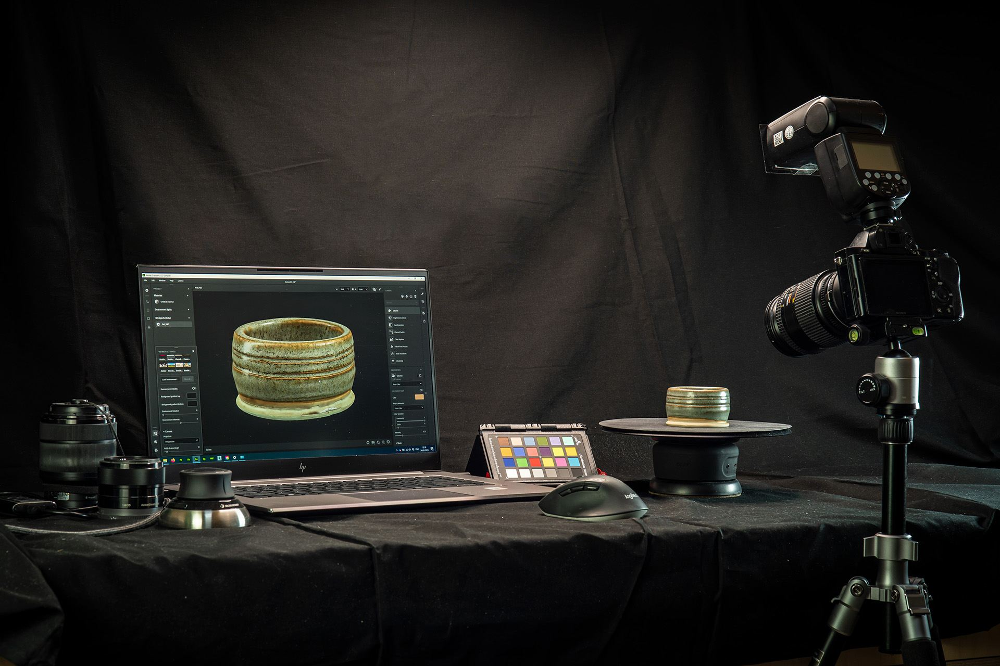
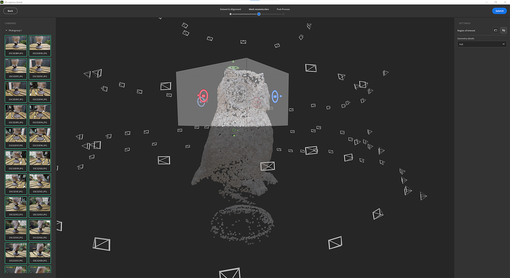

# 版本4.0

借助&#x200B;**Substance 3D Sampler 4.0**，您可以使用真实图像通过自动的主体蒙版、纹理映射和几何抽取创建3D对象。 此版本引入了一些UX改进，作为Python API中的新可能性。

*发行日期：2023年1月31日*

## 3D 捕捉

使用Substance 3D Sampler 4.0，您现在可以从图像创建3D对象。

我们集成了摄影测量功能。 摄影测量是从图像中进行测量的技术过程。 Sampler就是通过运用一系列照片创建3D网格的方法。

只需从一系列可拍摄对象可见表面的照片开始，智能手机或DLSR相机就可以发挥很好的作用。

在[此处](../features-and-workflows/3d-capture.md)了解分步工作流程。

## 高光

### 自动蒙版

删除要3D 捕捉的对象的背景。 通过蒙版选项卡导入图像后，创建自动生成对象的蒙版。

使用蒙版具有许多优点。 它允许检测特征，并且仅重构非蒙版区域。

{width="500px"}

### 定义您的重建区域

切换目标区域可在对齐图像后激活定界框。 设置和对齐要重建的精确区域。

{width="500px"}

### 已连接后期处理

重建3D对象后，使用自动抽取、UV展开和烘焙来优化结果。

后期处理可帮助您根据需要和使用方式调整和优化网格和纹理。

重建的结果可以生成具有数百万个多边形和高达16K纹理的网格。 这通常不会针对渲染、实时或AR体验进行优化。

后处理步骤会自动链接4个步骤：

* 抽取
* UV展开
* 重新投影
* Baking

{width="500px"}

### 导出至主要文件格式

以所有标准文件格式导出重构的3D对象，以便随时随地使用。

{width="500px"}

## 视口

2D和3D视口可以垂直调整大小、交换和栈叠。

{width="500px"}

## 脚本编写

我们把导出功能拆分为4个：

* 导出材料： `export_material`
* 导出环境光照： `export_environment_light`
* 导出带纹理或不带纹理的网格： `export_mesh`或`export_3d_object`

我们添加了一个新函数来导入具有特定用法的纹理： `import_textures`

Sampler现在将在启动脚本和存储在由以下两个环境变量定义的路径上的插件时加载：

* `SAMPLER_PLUGIN_PATH`
* `SAMPLER_SCRIPT_PATH`

## 教程

## 发行说明

1. **0.0香蕉**

   *（2022年1月31日发布）*

   **已添加**

* [3D 捕捉]从图像创建3D对象
* [3D 捕捉]专用3D 捕捉向导
* [3D 捕捉]在数据集上导入或生成黑白蒙版
* [3D 捕捉]对齐结果 — 将所有匹配的特征作为点云查看
* [3D 捕捉]对齐结果 — 查看并与与每张已对齐照片相关的相机进行交互
* [3D 捕捉]使用定界框构件定义重建区域
* [3D 捕捉]缩放、平移和旋转定界框构件的所有轴
* [3D 捕捉]定义重构网格的几何精度
* [3D 捕捉]通过创建新版本来优化网格和纹理
* [3D 捕捉]每个版本都会自动缩减到设定的目标人脸数
* [3D 捕捉]后处理步骤自动解包、重新投影纹理，然后从高多边形网格中烘焙常规Height和自适应光学信息
* [3D 捕捉]将原始结果或版本添加到Sampler项目
* [3D 捕捉]新增网格后期处理图层，可自动对底层网格图层进行缩减、展开、重新投影纹理和烘焙细节
* [3D 捕捉]新的网格变换图层可缩放、旋转或平移底层网格图层
* [导出]新的“导出”窗口
* [导出]专用设置和UI，具体取决于资源类型（材质、环境光照、网格）
* [导出]将网格导出为USD、USDA、USDZ、glTF、glb、obj、fbx、stl
* [导出]导出Substance文件(SBSAR、SBS)时定义材料类型
* [UI]在“首选项”弹出窗口中，将缓存设置移至新选项卡
* [应用程序]现在，可以对2D和3D视口进行大小调整、交换和垂直栈叠
* [Application]用于添加额外的入门资源的新SAMPLER\_RESOURCES\_PATH环境变量
* [脚本]添加了SAMPLER\_PLUGIN\_PATH和SAMPLER\_SCRIPT\_PATH环境变量，以便在启动时导入增效工具和脚本
* [脚本]添加了材料、环境光照和3D对象的导出功能
* [脚本]将标识符、默认值、最小值和最大值、标签以及枚举值添加到参数
* [脚本]添加了import\_textures函数，可在导入图像时输入自定义用法

**已修复**

* [应用程序]打开最近的项目并在确认对话框中保存时崩溃
* [应用程序]“文件”对话框禁止打开.ssa文件
* [应用程序] macOS上的后台窗口中可能会显示“文件”对话框
* [应用程序]打开3.2项目时潜在崩溃
* [应用程序]选择文件会关闭“文件”对话框，然后再显示警告
* [曝光的参数]导出参数环境光不起作用
* [图层]图层栈栈中的“单击此处浏览”链接不再有效
* [图层]在同一图层中绘制多个图像有时不起作用
* [图层]在图层属性中设置图像不会更新图像选择器缩览图
* [图层]微调作为图层添加的Sampler资源不起作用
* [Project]打开项目时意外更新资源
* [脚本]在Windows上，浏览到插件文件夹有时会失败
* [脚本]在Python脚本中使用“open\_project()”时崩溃
* [脚本] API中缺少JPEG导出
* [脚本] “日志”面板不是只读的
* [脚本] image\_picker参数值不起作用
* [UI]“项目”面板中缺少环境光照的资源图标
* [UI]首选项弹出窗口中的发送到Designer格式下拉菜单可以为空
* [UI]某些按钮的样式不正确
* [UI]该标签与按钮组小组件中的按钮重叠
* [UI]在“设置物理尺寸”菜单中，“工具”的工具提示位置不正确
* [UI]更改语言时，“文件”菜单未对齐

**已知问题**

* [3D 捕捉]使用蒙版时，纹理投影可能会损坏
* [3D 捕捉]如果网格变换中的比例太小，对象上可能会出现小的伪像
* [3D 捕捉]导出的网格可能非常小。 重置网格变换的比例并重新导出
* [拾色器]在第二个显示器上选取具有不同分辨率的颜色可能不起作用
* [Content]形状灯光构件在球面投影模式下不起作用
* [互操作性]向Stager发送位移的材料将失去位移控制权限
