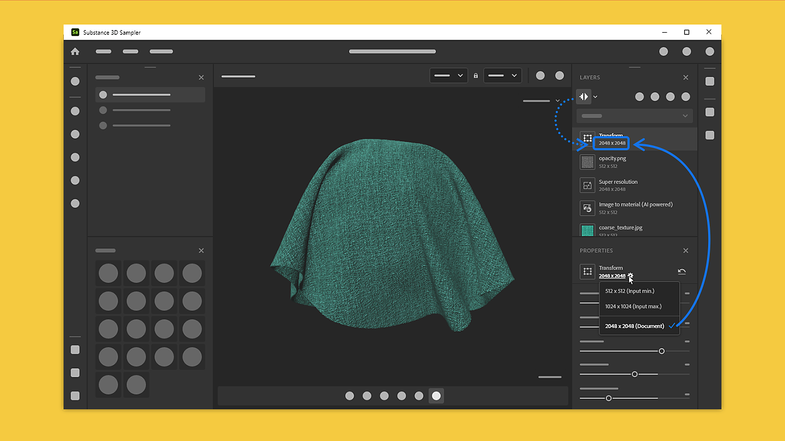

# 版本4.2

<b>Substance 3D Sampler 4.2</b>引入了一个新的AI支持版本<b>图像到材质</b>和一个新的<b>AI升级</b>功能。 此版本包括对每图层分辨率的完全控制。

*发行日期：2023年9月5日*

## 图像到材质 — 新版本

“图像到材质”通过单个图像为您生成材质通道（基色、粗糙度、法线、位移和金属）。

更新版本的“图像到材质”改进了素材生成和支持的素材范围。

现在，“图像到材质”已经过所有材质类型的培训，可为织物、塑料、木材等生成更出色的效果。

更新后的版本有一个新参数，可用于选择材料类型以准确生成所有通道并自动调整范围。

## AI放大

借助新的“放大”图层，Sampler可将您的资源（素材或图像）的分辨率乘以2或4来增强素材或图像的特征。

这能够提高低分辨率纹理的质量和细节级别，并在纹理放大期间保持地图之间的特征一致性。

“放大”滤镜增强了素材的基色、法线、Height、粗糙度和金属色通道。

要最大化结果质量，应在数据上使用“放大”滤镜（素材和图像），保持其原始分辨率，而不更改以前的分辨率。

## 图层分辨率

新的图层分辨率系统可让您完全控制每个图层的分辨率。 图层采用与文档大小或下方图层分辨率相同的分辨率。

分辨率显示在每个图层上，以轻松直观地看到您的作品对您的材质分辨率的影响。

这样，您不仅可以提高素材的质量，还可以在处理资源时提高性能。

## 教程

## 发行说明

<b>4.2道拉亚基</b>

*（发布日期：2023年9月5日）*

<b>已添加</b>：

* [内容]图像到材质(AI)和Delighter滤镜得到大幅改进
* [内容]新的放大滤镜
* [内容]裁剪滤镜现在具有动态输出分辨率。
* [材质创建模板]添加文档大小设置。
* [素材创建模板]新增了“添加裁剪”切换按钮。
* [材质创建模板]新的“放大材质”切换开关
* [材质创建模板]显示导入的图像大小
* [素材创建模板]当某些导入的图像无法使用时，提供反馈
* [材质创建模板]图像大小不一致时发出警告
* [材料创建模板]新警告和工具提示
* [图层]显示图层栈叠中图层的分辨率
* [图层]图层计算分辨率现在可以设置为“文档大小”或“输入大小”
* [图层]在图层栈栈中显示图层分辨率
* [图层]在适用时，将图层分辨率策略切换到“文档”或“图层输入”
* [图层]手动添加“放大”滤镜时警告用户并提供一些文档
* [图层]在进行线性放大时警告用户，并建议改用“放大”滤镜
* [图层]现在，可以更快地取消计算“图像到材质”(AI)图层，以便缩短调整图层栈栈时的渲染时间
* [图层]现在，可以更快地取消计算放大图层，以便缩短调整图层栈栈时的渲染时间
* [导出]允许覆盖所导出纹理的分辨率
* [导出]导出列表的渠道现在已排序
* [导出]在要导出的通道列表中显示通道分辨率
* [应用程序]启用或禁用GPU加速神经网络的新首选项
* [UI]改进了分辨率下拉菜单
* [UI]用于网格变换、网格后期处理和编织滤镜的新图标
* [UI]将“共享”面板重命名为“导出”
* [脚本]将图层输出分辨率支持添加到导出API
* [脚本]向图像导入API中添加了“裁剪”、“放大”和“文档大小”
* [用户引导]新教程
* [入职]更新“欢迎”和“新增功能”屏幕内容
* [Engine]将Substance 引擎更新到9.0.1版

<b>已修复：</b>

* [3D 捕捉]改进对齐方式设置参数中的“精度”选项命名
* [应用程序]导入16维度的非倍数图像可能会导致崩溃
* [应用程序]在“项目”面板中复制资源时崩溃
* [应用程序]在“项目”面板中切换资源时崩溃
* [Content]为Snow滤镜绘制自定义蒙版无法正常工作
* [公开的参数]切换素材时，公开的参数更改可能会丢失
* [互操作性]从“导出”面板发送材料可能会导致崩溃
* [图层]从单个图像输入切换到素材输入时，内容识别填充停止计算
* [图层]复制包含素材的环境光后崩溃
* [图层]如果图像文件已重命名，图像导入图层在“属性”面板中显示错误的图像名称
* [图层]有时，旋转器显示在非活动图层上
* [图层]有时，在“图像导入”图层中更改图像的输出使用情况不起作用
* [图层]创建模板窗口中出现拼写错误
* [UI] 3D视区载入工具提示存在焦点问题
* [UI]如果文件名太长，图像名称可能会溢出
* [UI]使用橡皮擦时出现轻微画笔工具栏布局问题
* [UI]在“查看器设置”面板中，某些语言的字符串被截断
* [UI]当显示视窗工具提示弹出窗口时，按“空格”会创建新项目
