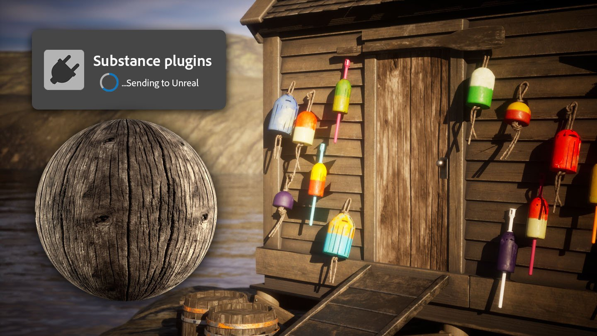

# 版本4.5

<b>Substance 3D Sampler 4.5</b>引入了第三方应用程序的发送到。

它允许通过单击一次即可将资源从Sampler发送到第三方应用程序，从而避免必须手动执行导出和导入过程并节省时间。

[此处](../pipeline-and-integrations/substance-connector.md)有详细信息。

*发行日期：2024年7月10日*

## 发行说明

*（发布日期：2024年7月18日）*

<b>已添加</b>：

* [互操作性]将材料发送到UE5、Blender、Maya、3DsMax Unity
* [内容]新的纹理生成器类别 — 渐变
* [Content]HDRI 工具 — 新的环境旋转滤镜

<b>已修复：</b>

* [公开的参数]公开.sbsar输入值不起作用
* [图层]基色与灰度图像一起变成红色
* [渲染]颜色通道中使用的灰度图像具有错误的色彩空间
* [脚本]使用导出预设有时无法导出预期的通道
* [Content]Dirt — 将图像上的Dirt滤镜应用于素材可生成黑色法线
* [内容]浮雕 — 浮雕滤镜中图案的缩放在0和1之间不是线性的
* [内容]使其平铺 — 改进了正常和Height一致性
