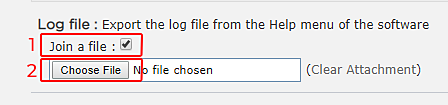

# 导出日志文件

当您需要有关Substance 3D Sampler的支持时，最好共享日志文件，因为它可提供有关计算机配置的上下文。

## 从应用程序导出日志文件

通过转到&#x200B;**帮助**&#x200B;菜单并选择&#x200B;**导出日志文件**&#x200B;项，可以直接从3D Sampler导出日志文件。

## 在磁盘上手动检索日志文件

如果无法启动Substance 3D Sampler，可通过进入以下文件夹手动检索日志文件：

Adobe版本：

* **Windows**： C:\Users\**&#x200B;用户名**\AppData\Local\Adobe\Adobe Substance 3D Sampler\log.txt
* **Mac OS**： Macintosh > Users > **用户名** > Library > Application Support > Library > Adobe Substance 3D Sampler > log.txtAdobe

Substance3D版本：

* **Windows**： C:\Users\**&#x200B;用户名**\AppData\Local\Allegorithmic\Adobe Substance 3D Sampler\log.txt
* **Mac OS**： Macintosh > Users > **用户名** > Library > Application Support > Allegorithmic > Adobe Substance 3D Sampler > log.txt
* **Linux**： /home/**用户名**/.local/share/Allegorithmic/Substance 3D Sampler/log.txt

>[!NOTE]
>
> 在&#x200B;**Windows**&#x200B;上，“Appdata”是隐藏的文件夹。\
> 在&#x200B;**Mac OS**&#x200B;上，“library”是隐藏的文件夹。\
> 在&#x200B;**Linux**&#x200B;上，“.local”是隐藏文件夹。

## 将日志文件附加到论坛帖子

在论坛上请求支持时，需要日志文件。 以下是将日志文件附加到消息的方法：

1. 检查“**加入文件**”设置
1. 单击“**选择文件**”按钮，然后查找您的日志文件
1. 当您的消息可以发布和上传日志文件时，单击“**发布**”

